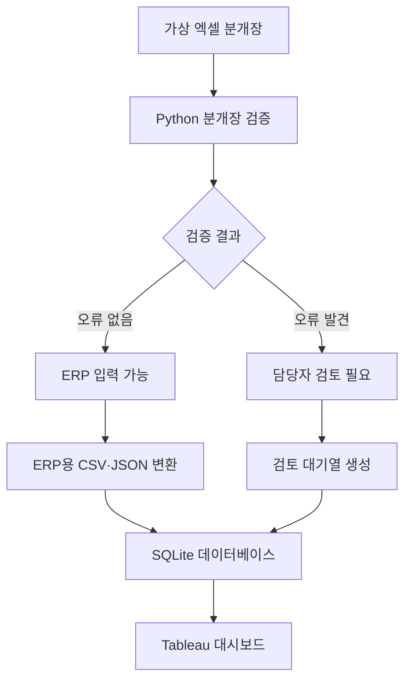
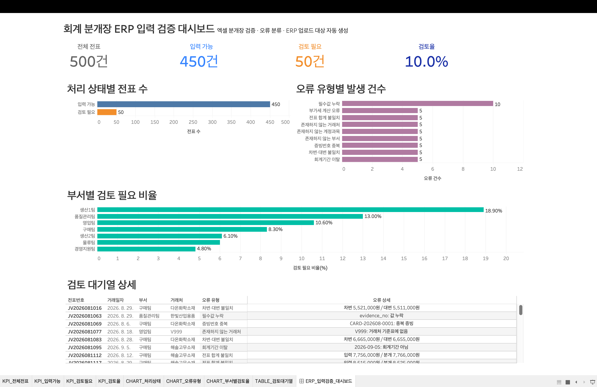

# 회계 분개장 ERP 입력 검증 자동화

엑셀 분개장의 입력 오류를 자동으로 검증하고, 정상 전표를 ERP 업로드용 CSV·JSON으로 변환하는 제조기업 회계업무 지원 프로젝트입니다.

검증 결과는 SQLite 데이터베이스에 저장하고 Tableau 대시보드에서 처리 현황과 오류 내역을 확인할 수 있도록 구성했습니다.

## 1. 프로젝트 배경

경영사무 인턴 당시 엑셀 분개장을 확인하면서 거래일자, 계정과목, 차변·대변 금액, 거래처, 적요, 부가세 및 증빙정보를 ERP에 직접 입력했습니다.

반복적인 수작업 입력 과정에서는 다음 문제가 발생할 수 있었습니다.

- 기준정보에 없는 계정과목·거래처·부서 입력
- 차변과 대변 금액 불일치
- 부가세 계산 오류
- 증빙번호 중복 및 필수값 누락
- 회계기간을 벗어난 거래 입력
- 검토 대상과 입력 가능 전표의 수작업 분류

이러한 경험을 바탕으로 엑셀 분개장을 사전 검증하고, 정상 전표와 검토 필요 전표를 자동으로 분리하는 시스템을 구현했습니다.

## 2. 프로젝트 목표

- 엑셀 분개장의 주요 입력 오류 자동 검증
- 오류가 없는 전표와 검토가 필요한 전표 분리
- 정상 전표를 ERP 입력용 행 구조로 변환
- ERP 연계용 CSV 및 JSON 생성
- 검증 결과의 데이터베이스 저장
- 처리 현황과 검토 대기열의 BI 대시보드 제공

본 프로젝트는 ERP에 직접 전표를 등록하는 시스템이 아니라, ERP 입력 전 단계에서 데이터 품질을 검사하고 업로드 데이터를 준비하는 지원 시스템입니다.

## 3. 전체 처리 흐름



## 4. 주요 기능

### 기준정보 검증

- 계정과목 코드 존재 여부
- 거래처 코드 존재 여부
- 부서 코드 존재 여부
- 비활성 기준정보 사용 여부

### 회계 데이터 검증

- 차변 합계와 대변 합계 일치 여부
- 전표 총금액과 분개 합계 일치 여부
- 공급가액 기준 부가세 계산 여부
- 회계기간 포함 여부

### 입력 품질 검증

- 필수값 누락 여부
- 증빙번호 중복 여부
- 전표번호 중복 여부

### ERP 입력 데이터 생성

- 검증 통과 전표만 ERP 입력 대상으로 분리
- 한 행으로 구성된 엑셀 분개장을 ERP용 분개 행으로 변환
- CSV 및 JSON 형식 저장
- 변환 후 차변·대변 재검증

### 데이터베이스 및 BI

- 기준정보, 원본 전표, 오류 내역, ERP 전표 저장
- 외래키 무결성 검사
- 처리 상태, 오류 유형, 부서별 검토율 집계
- Tableau 검토 대기열 제공

## 5. 사용 기술

| 구분 | 기술 |
|---|---|
| 개발 언어 | Python 3.12 |
| 데이터 처리 | pandas, NumPy |
| Excel 처리 | openpyxl |
| 데이터 형식 | CSV, Excel, JSON |
| 데이터베이스 | SQLite, SQL |
| 시각화 | Tableau Public |
| 개발 환경 | VS Code, Jupyter Notebook, Anaconda |

SQLite는 별도의 서버 없이 전체 처리 구조를 재현하기 위해 사용했습니다. 실제 운영환경에서는 Oracle 또는 MS-SQL 구조로 확장할 수 있습니다.

## 6. 가상 데이터 구성

실제 회사의 회계자료나 개인정보는 사용하지 않았습니다.

가상의 자동차부품 제조기업을 기준으로 다음 데이터를 구성했습니다.

- 계정과목: 22개
- 거래처: 12개
- 부서: 7개
- 분개장 전표: 500건
- 의도적으로 주입한 오류: 50건

정상 전표를 먼저 생성한 뒤 서로 다른 전표에 오류를 하나씩 주입해 검증 결과를 비교했습니다.

## 7. 검증 결과

| 지표 | 결과 |
|---|---:|
| 전체 전표 | 500건 |
| 주입 오류 | 50건 |
| 탐지 오류 | 50건 |
| 정상 탐지 | 50건 |
| 미탐지 | 0건 |
| 추가 탐지 | 0건 |
| ERP 입력 가능 | 450건 |
| 검토 필요 | 50건 |
| ERP 분개 행 | 1,350행 |
| 차변·대변 불일치 전표 | 0건 |
| 데이터베이스 외래키 오류 | 0건 |

정밀도와 재현율은 모두 100%로 확인됐습니다.

단, 이 수치는 직접 정의하고 주입한 오류를 대상으로 측정한 통제된 테스트 결과입니다. 실제 기업의 다양한 예외 상황에 대한 일반적인 성능을 의미하지 않습니다.

## 8. Tableau 대시보드



대시보드에서는 다음 정보를 확인할 수 있습니다.

- 전체·입력 가능·검토 필요 전표 수
- 전체 전표 대비 검토 필요 비율
- 처리 상태별 전표 수
- 오류 유형별 발생 건수
- 부서별 검토 필요 비율
- 전표별 오류 상세내용

## 9. 프로젝트 구조

```text
accounting_erp_automation/
├── dashboard/
│   ├── data/
│   └── accounting_erp_dashboard.twbx
├── data/
│   ├── expected/
│   ├── master/
│   ├── processed/
│   └── raw/
├── docs/
│   └── project_plan.md
├── notebooks/
│   ├── 01_create_journal_template.ipynb
│   ├── 02_validate_master_data.ipynb
│   ├── 03_create_error_data.ipynb
│   ├── 04_validate_journal.ipynb
│   ├── 05_prepare_erp_upload.ipynb
│   └── 06_generate_bulk_journal.ipynb
├── outputs/
├── sql/
│   ├── schema.sql
│   └── analysis_queries.sql
├── src/
│   ├── journal_validator.py
│   ├── prepare_erp_upload.py
│   ├── load_database.py
│   ├── export_dashboard_data.py
│   └── run_pipeline.py
├── README.md
└── requirements.txt
```

## 10. 실행 방법

### 패키지 설치

```bash
python -m pip install -r requirements.txt
```

### 전체 파이프라인 실행

```bash
python src/run_pipeline.py
```

전체 실행 과정은 다음 순서로 진행됩니다.
# 회계 분개장 ERP 입력 검증 자동화

엑셀 분개장의 입력 오류를 자동으로 검증하고, 정상 전표를 ERP 업로드용 CSV·JSON으로 변환하는 제조기업 회계업무 지원 프로젝트입니다.

검증 결과는 SQLite 데이터베이스에 저장하고 Tableau 대시보드에서 처리 현황과 오류 내역을 확인할 수 있도록 구성했습니다.

## 1. 프로젝트 배경

경영사무 인턴 당시 엑셀 분개장을 확인하면서 거래일자, 계정과목, 차변·대변 금액, 거래처, 적요, 부가세 및 증빙정보를 ERP에 직접 입력했습니다.

반복적인 수작업 입력 과정에서는 다음 문제가 발생할 수 있었습니다.

- 기준정보에 없는 계정과목·거래처·부서 입력
- 차변과 대변 금액 불일치
- 부가세 계산 오류
- 증빙번호 중복 및 필수값 누락
- 회계기간을 벗어난 거래 입력
- 검토 대상과 입력 가능 전표의 수작업 분류

이러한 경험을 바탕으로 엑셀 분개장을 사전 검증하고, 정상 전표와 검토 필요 전표를 자동으로 분리하는 시스템을 구현했습니다.

## 2. 프로젝트 목표

- 엑셀 분개장의 주요 입력 오류 자동 검증
- 오류가 없는 전표와 검토가 필요한 전표 분리
- 정상 전표를 ERP 입력용 행 구조로 변환
- ERP 연계용 CSV 및 JSON 생성
- 검증 결과의 데이터베이스 저장
- 처리 현황과 검토 대기열의 BI 대시보드 제공

본 프로젝트는 ERP에 직접 전표를 등록하는 시스템이 아니라, ERP 입력 전 단계에서 데이터 품질을 검사하고 업로드 데이터를 준비하는 지원 시스템입니다.

## 3. 전체 처리 흐름


## 4. 주요 기능

### 기준정보 검증

- 계정과목 코드 존재 여부
- 거래처 코드 존재 여부
- 부서 코드 존재 여부
- 비활성 기준정보 사용 여부

### 회계 데이터 검증

- 차변 합계와 대변 합계 일치 여부
- 전표 총금액과 분개 합계 일치 여부
- 공급가액 기준 부가세 계산 여부
- 회계기간 포함 여부

### 입력 품질 검증

- 필수값 누락 여부
- 증빙번호 중복 여부
- 전표번호 중복 여부

### ERP 입력 데이터 생성

- 검증 통과 전표만 ERP 입력 대상으로 분리
- 한 행으로 구성된 엑셀 분개장을 ERP용 분개 행으로 변환
- CSV 및 JSON 형식 저장
- 변환 후 차변·대변 재검증

### 데이터베이스 및 BI

- 기준정보, 원본 전표, 오류 내역, ERP 전표 저장
- 외래키 무결성 검사
- 처리 상태, 오류 유형, 부서별 검토율 집계
- Tableau 검토 대기열 제공

## 5. 사용 기술

| 구분 | 기술 |
|---|---|
| 개발 언어 | Python 3.12 |
| 데이터 처리 | pandas, NumPy |
| Excel 처리 | openpyxl |
| 데이터 형식 | CSV, Excel, JSON |
| 데이터베이스 | SQLite, SQL |
| 시각화 | Tableau Public |
| 개발 환경 | VS Code, Jupyter Notebook, Anaconda |

SQLite는 별도의 서버 없이 전체 처리 구조를 재현하기 위해 사용했습니다. 실제 운영환경에서는 Oracle 또는 MS-SQL 구조로 확장할 수 있습니다.

## 6. 가상 데이터 구성

실제 회사의 회계자료나 개인정보는 사용하지 않았습니다.

가상의 자동차부품 제조기업을 기준으로 다음 데이터를 구성했습니다.

- 계정과목: 22개
- 거래처: 12개
- 부서: 7개
- 분개장 전표: 500건
- 의도적으로 주입한 오류: 50건

정상 전표를 먼저 생성한 뒤 서로 다른 전표에 오류를 하나씩 주입해 검증 결과를 비교했습니다.

## 7. 검증 결과

| 지표 | 결과 |
|---|---:|
| 전체 전표 | 500건 |
| 주입 오류 | 50건 |
| 탐지 오류 | 50건 |
| 정상 탐지 | 50건 |
| 미탐지 | 0건 |
| 추가 탐지 | 0건 |
| ERP 입력 가능 | 450건 |
| 검토 필요 | 50건 |
| ERP 분개 행 | 1,350행 |
| 차변·대변 불일치 전표 | 0건 |
| 데이터베이스 외래키 오류 | 0건 |

정밀도와 재현율은 모두 100%로 확인됐습니다.

단, 이 수치는 직접 정의하고 주입한 오류를 대상으로 측정한 통제된 테스트 결과입니다. 실제 기업의 다양한 예외 상황에 대한 일반적인 성능을 의미하지 않습니다.

## 8. Tableau 대시보드


대시보드에서는 다음 정보를 확인할 수 있습니다.

- 전체·입력 가능·검토 필요 전표 수
- 전체 전표 대비 검토 필요 비율
- 처리 상태별 전표 수
- 오류 유형별 발생 건수
- 부서별 검토 필요 비율
- 전표별 오류 상세내용

## 9. 프로젝트 구조

```text
accounting_erp_automation/
├── dashboard/
│   ├── data/
│   └── accounting_erp_dashboard.twbx
├── data/
│   ├── expected/
│   ├── master/
│   ├── processed/
│   └── raw/
├── docs/
│   └── project_plan.md
├── notebooks/
│   ├── 01_create_journal_template.ipynb
│   ├── 02_validate_master_data.ipynb
│   ├── 03_create_error_data.ipynb
│   ├── 04_validate_journal.ipynb
│   ├── 05_prepare_erp_upload.ipynb
│   └── 06_generate_bulk_journal.ipynb
├── outputs/
├── sql/
│   ├── schema.sql
│   └── analysis_queries.sql
├── src/
│   ├── journal_validator.py
│   ├── prepare_erp_upload.py
│   ├── load_database.py
│   ├── export_dashboard_data.py
│   └── run_pipeline.py
├── README.md
└── requirements.txt
```# 회계 분개장 ERP 입력 검증 자동화

엑셀 분개장의 입력 오류를 자동으로 검증하고, 정상 전표를 ERP 업로드용 CSV·JSON으로 변환하는 제조기업 회계업무 지원 프로젝트입니다.

검증 결과는 SQLite 데이터베이스에 저장하고 Tableau 대시보드에서 처리 현황과 오류 내역을 확인할 수 있도록 구성했습니다.

## 1. 프로젝트 배경

경영사무 인턴 당시 엑셀 분개장을 확인하면서 거래일자, 계정과목, 차변·대변 금액, 거래처, 적요, 부가세 및 증빙정보를 ERP에 직접 입력했습니다.

반복적인 수작업 입력 과정에서는 다음 문제가 발생할 수 있었습니다.

- 기준정보에 없는 계정과목·거래처·부서 입력
- 차변과 대변 금액 불일치
- 부가세 계산 오류
- 증빙번호 중복 및 필수값 누락
- 회계기간을 벗어난 거래 입력
- 검토 대상과 입력 가능 전표의 수작업 분류

이러한 경험을 바탕으로 엑셀 분개장을 사전 검증하고, 정상 전표와 검토 필요 전표를 자동으로 분리하는 시스템을 구현했습니다.

## 2. 프로젝트 목표

- 엑셀 분개장의 주요 입력 오류 자동 검증
- 오류가 없는 전표와 검토가 필요한 전표 분리
- 정상 전표를 ERP 입력용 행 구조로 변환
- ERP 연계용 CSV 및 JSON 생성
- 검증 결과의 데이터베이스 저장
- 처리 현황과 검토 대기열의 BI 대시보드 제공

본 프로젝트는 ERP에 직접 전표를 등록하는 시스템이 아니라, ERP 입력 전 단계에서 데이터 품질을 검사하고 업로드 데이터를 준비하는 지원 시스템입니다.

## 3. 전체 처리 흐름


## 4. 주요 기능

### 기준정보 검증

- 계정과목 코드 존재 여부
- 거래처 코드 존재 여부
- 부서 코드 존재 여부
- 비활성 기준정보 사용 여부

### 회계 데이터 검증

- 차변 합계와 대변 합계 일치 여부
- 전표 총금액과 분개 합계 일치 여부
- 공급가액 기준 부가세 계산 여부
- 회계기간 포함 여부

### 입력 품질 검증

- 필수값 누락 여부
- 증빙번호 중복 여부
- 전표번호 중복 여부

### ERP 입력 데이터 생성

- 검증 통과 전표만 ERP 입력 대상으로 분리
- 한 행으로 구성된 엑셀 분개장을 ERP용 분개 행으로 변환
- CSV 및 JSON 형식 저장
- 변환 후 차변·대변 재검증

### 데이터베이스 및 BI

- 기준정보, 원본 전표, 오류 내역, ERP 전표 저장
- 외래키 무결성 검사
- 처리 상태, 오류 유형, 부서별 검토율 집계
- Tableau 검토 대기열 제공

## 5. 사용 기술

| 구분 | 기술 |
|---|---|
| 개발 언어 | Python 3.12 |
| 데이터 처리 | pandas, NumPy |
| Excel 처리 | openpyxl |
| 데이터 형식 | CSV, Excel, JSON |
| 데이터베이스 | SQLite, SQL |
| 시각화 | Tableau Public |
| 개발 환경 | VS Code, Jupyter Notebook, Anaconda |

SQLite는 별도의 서버 없이 전체 처리 구조를 재현하기 위해 사용했습니다. 실제 운영환경에서는 Oracle 또는 MS-SQL 구조로 확장할 수 있습니다.

## 6. 가상 데이터 구성

실제 회사의 회계자료나 개인정보는 사용하지 않았습니다.

가상의 자동차부품 제조기업을 기준으로 다음 데이터를 구성했습니다.

- 계정과목: 22개
- 거래처: 12개
- 부서: 7개
- 분개장 전표: 500건
- 의도적으로 주입한 오류: 50건

정상 전표를 먼저 생성한 뒤 서로 다른 전표에 오류를 하나씩 주입해 검증 결과를 비교했습니다.

## 7. 검증 결과

| 지표 | 결과 |
|---|---:|
| 전체 전표 | 500건 |
| 주입 오류 | 50건 |
| 탐지 오류 | 50건 |
| 정상 탐지 | 50건 |
| 미탐지 | 0건 |
| 추가 탐지 | 0건 |
| ERP 입력 가능 | 450건 |
| 검토 필요 | 50건 |
| ERP 분개 행 | 1,350행 |
| 차변·대변 불일치 전표 | 0건 |
| 데이터베이스 외래키 오류 | 0건 |

정밀도와 재현율은 모두 100%로 확인됐습니다.

단, 이 수치는 직접 정의하고 주입한 오류를 대상으로 측정한 통제된 테스트 결과입니다. 실제 기업의 다양한 예외 상황에 대한 일반적인 성능을 의미하지 않습니다.

## 8. Tableau 대시보드


대시보드에서는 다음 정보를 확인할 수 있습니다.

- 전체·입력 가능·검토 필요 전표 수
- 전체 전표 대비 검토 필요 비율
- 처리 상태별 전표 수
- 오류 유형별 발생 건수
- 부서별 검토 필요 비율
- 전표별 오류 상세내용

## 9. 프로젝트 구조

```text
accounting_erp_automation/
├── dashboard/
│   ├── data/
│   └── accounting_erp_dashboard.twbx
├── data/
│   ├── expected/
│   ├── master/
│   ├── processed/
│   └── raw/
├── docs/
│   └── project_plan.md
├── notebooks/
│   ├── 01_create_journal_template.ipynb
│   ├── 02_validate_master_data.ipynb
│   ├── 03_create_error_data.ipynb
│   ├── 04_validate_journal.ipynb
│   ├── 05_prepare_erp_upload.ipynb
│   └── 06_generate_bulk_journal.ipynb
├── outputs/
├── sql/
│   ├── schema.sql
│   └── analysis_queries.sql
├── src/
│   ├── journal_validator.py
│   ├── prepare_erp_upload.py
│   ├── load_database.py
│   ├── export_dashboard_data.py
│   └── run_pipeline.py
├── README.md
└── requirements.txt
```

## 10. 실행 방법

### 패키지 설치

```bash
python -m pip install -r requirements.txt
```

### 전체 파이프라인 실행

```bash
python src/run_pipeline.py
```

전체 실행 과정은 다음 순서로 진행됩니다.

1. 분개장 오류 검증
2. ERP 업로드 데이터 변환
3. SQLite 데이터베이스 적재
4. Tableau 대시보드용 데이터 생성

실행 완료 후 Tableau에서 데이터 원본을 새로 고치면 최신 결과가 반영됩니다.

## 11. 주요 출력 파일

| 파일 | 설명 |
|---|---|
| `bulk_validation_result.csv` | 전표별 오류 탐지 결과 |
| `bulk_transaction_status.csv` | 입력 가능·검토 필요 상태 |
| `bulk_review_queue.csv` | 담당자 검토 대기열 |
| `bulk_erp_upload.csv` | ERP 업로드용 분개 행 |
| `bulk_erp_upload.json` | ERP 연계용 JSON |
| `accounting_erp.db` | SQLite 데이터베이스 |
| `dashboard/data/*.csv` | Tableau 시각화용 집계 데이터 |

## 12. 한계와 개선 방향

- 실제 ERP API와 직접 연동하지 않고 업로드 파일 생성까지만 구현
- 가상 제조기업 데이터와 사전에 정의한 오류를 사용
- 복합전표와 예외적인 세무처리 규칙은 제한적으로 반영
- 사용자 권한, 승인 이력 및 수정 이력 관리 미구현

향후에는 다음 기능으로 확장할 수 있습니다.

- Oracle 또는 MS-SQL 기반 운영 데이터베이스 전환
- 계정과목 및 거래처 자동완성
- 적요 기반 계정과목 추천
- 담당자 승인 및 수정 이력 관리
- ERP API 또는 RPA 입력 연계
- 이메일·메신저 오류 알림

## 10. 실행 방법

### 패키지 설치

```bash
python -m pip install -r requirements.txt
```

### 전체 파이프라인 실행

```bash
python src/run_pipeline.py
```

전체 실행 과정은 다음 순서로 진행됩니다.

1. 분개장 오류 검증
2. ERP 업로드 데이터 변환
3. SQLite 데이터베이스 적재
4. Tableau 대시보드용 데이터 생성

실행 완료 후 Tableau에서 데이터 원본을 새로 고치면 최신 결과가 반영됩니다.

## 11. 주요 출력 파일

| 파일 | 설명 |
|---|---|
| `bulk_validation_result.csv` | 전표별 오류 탐지 결과 |
| `bulk_transaction_status.csv` | 입력 가능·검토 필요 상태 |
| `bulk_review_queue.csv` | 담당자 검토 대기열 |
| `bulk_erp_upload.csv` | ERP 업로드용 분개 행 |
| `bulk_erp_upload.json` | ERP 연계용 JSON |
| `accounting_erp.db` | SQLite 데이터베이스 |
| `dashboard/data/*.csv` | Tableau 시각화용 집계 데이터 |

## 12. 한계와 개선 방향

- 실제 ERP API와 직접 연동하지 않고 업로드 파일 생성까지만 구현
- 가상 제조기업 데이터와 사전에 정의한 오류를 사용
- 복합전표와 예외적인 세무처리 규칙은 제한적으로 반영
- 사용자 권한, 승인 이력 및 수정 이력 관리 미구현

향후에는 다음 기능으로 확장할 수 있습니다.

- Oracle 또는 MS-SQL 기반 운영 데이터베이스 전환
- 계정과목 및 거래처 자동완성
- 적요 기반 계정과목 추천
- 담당자 승인 및 수정 이력 관리
- ERP API 또는 RPA 입력 연계
- 이메일·메신저 오류 알림
1. 분개장 오류 검증
2. ERP 업로드 데이터 변환
3. SQLite 데이터베이스 적재
4. Tableau 대시보드용 데이터 생성

실행 완료 후 Tableau에서 데이터 원본을 새로 고치면 최신 결과가 반영됩니다.

## 11. 주요 출력 파일

| 파일 | 설명 |
|---|---|
| `bulk_validation_result.csv` | 전표별 오류 탐지 결과 |
| `bulk_transaction_status.csv` | 입력 가능·검토 필요 상태 |
| `bulk_review_queue.csv` | 담당자 검토 대기열 |
| `bulk_erp_upload.csv` | ERP 업로드용 분개 행 |
| `bulk_erp_upload.json` | ERP 연계용 JSON |
| `accounting_erp.db` | SQLite 데이터베이스 |
| `dashboard/data/*.csv` | Tableau 시각화용 집계 데이터 |

## 12. 한계와 개선 방향

- 실제 ERP API와 직접 연동하지 않고 업로드 파일 생성까지만 구현
- 가상 제조기업 데이터와 사전에 정의한 오류를 사용
- 복합전표와 예외적인 세무처리 규칙은 제한적으로 반영
- 사용자 권한, 승인 이력 및 수정 이력 관리 미구현

향후에는 다음 기능으로 확장할 수 있습니다.

- Oracle 또는 MS-SQL 기반 운영 데이터베이스 전환
- 계정과목 및 거래처 자동완성
- 적요 기반 계정과목 추천
- 담당자 승인 및 수정 이력 관리
- ERP API 또는 RPA 입력 연계
- 이메일·메신저 오류 알림