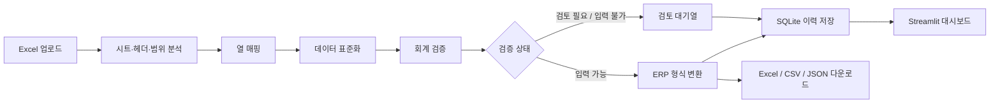
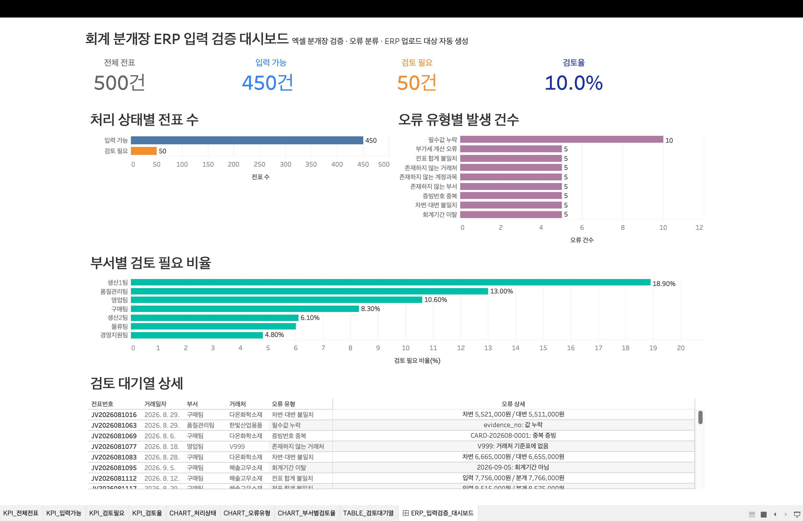

# 회계 분개장 자동 분석 및 ERP 변환 시스템

> 경영사무 인턴 경험에서 발견한 반복적인 ERP 입력 전 검증 업무를 자동화한 프로젝트입니다.  
> 다양한 형식의 Excel 회계 데이터를 **표준화 → 검증 → ERP 업로드 형식 변환 → SQLite 이력 저장 → 대시보드 확인**까지 연결합니다.


## 프로젝트 한눈에 보기

| 항목 | 내용 |
|---|---|
| 문제 | ERP 입력 전 Excel 분개장을 사람이 반복 확인해야 함 |
| 해결 | 파일 구조 분석, 열 매핑, 회계 검증, ERP 변환을 자동화 |
| 핵심 기술 | Python, pandas, openpyxl, SQLite, Streamlit, pytest |
| 테스트 | 자동화 테스트 90건, 회귀·경계값·통합 테스트 |
| 출력 | Excel / CSV / JSON / SQLite |
| 역할 | 기획, 데이터 구조 설계, 검증 로직, UI, DB, 테스트까지 직접 구현 |

## 왜 만들었나

경영사무 인턴 당시 Excel 분개장의 거래일자, 계정과목, 차변·대변 금액, 거래처, 적요, 부가세, 증빙정보를 확인하며 ERP 입력 업무를 경험했습니다.

이 과정에서 반복되는 수작업 검증을 줄이기 위해 다음 문제를 자동화 대상으로 정의했습니다.

- 기준정보에 없는 계정·거래처·부서 입력
- 차변/대변 금액 불일치
- 필수값 누락과 증빙번호 중복
- 회계기간을 벗어난 거래
- 공급가액·부가세·총액 불일치
- 입력 가능 전표와 검토 대상 전표의 수작업 분류

본 프로젝트는 실제 ERP에 자동 전기하는 시스템이 아니라, **ERP 입력 전 데이터 품질을 검증하고 업로드 가능한 데이터로 변환하는 업무 지원 시스템**입니다.

## 핵심 기능

### 1. 다양한 Excel 구조 분석 및 표준화
- 시트, 헤더, 데이터 범위 선택
- 가로형/세로형 분개 구조 처리
- 열 이름 별칭 자동 매핑
- 수동 매핑 수정 및 JSON 재사용
- 반복 헤더·합계행·미매핑 값 보존

### 2. 회계 데이터 자동 검증
- 필수값 누락
- 계정·거래처·부서 기준정보
- 차변/대변 균형
- 금액 해석 및 음수/0원 정책
- 공급가액·부가세·총액
- 증빙 중복
- 날짜·회계기간
- 전표번호 및 계정/금액 쌍 검증

검증 결과는 다음 세 상태로 분류합니다.

| 상태 | 의미 | ERP 대상 |
|---|---|---|
| 입력 가능 | ERROR/WARNING 없음 | 포함 |
| 검토 필요 | WARNING 존재 | 제외 |
| 입력 불가 | ERROR 존재 | 제외 |

### 3. ERP 업로드 데이터 생성
검증을 통과한 전표만 ERP 입력용 세로형 분개 구조로 변환하고, 변환 후 차변·대변을 다시 검증합니다.

- Excel
- CSV
- JSON

형식으로 결과를 생성합니다.

### 4. 처리 이력 및 결과 관리
- SQLite 실행 이력 저장
- 이전 실행 결과 조회
- 오류 상세 저장
- 날짜별 장부 및 일계표
- 처리 상태·오류·부서·거래처 집계
- 결과 파일 다운로드

## 전체 처리 흐름


```mermaid
flowchart LR
    A[Excel 업로드] --> B[시트·헤더·범위 분석]
    B --> C[열 매핑]
    C --> D[데이터 표준화]
    D --> E[회계 검증]
    E --> F{검증 상태}
    F -->|입력 가능| G[ERP 형식 변환]
    F -->|검토 필요 / 입력 불가| H[검토 대기열]
    G --> I[SQLite 이력 저장]
    H --> I
    I --> J[Streamlit 대시보드]
    G --> K[Excel / CSV / JSON 다운로드]
```

## 주요 화면

기존 Tableau 대시보드 예시입니다.



Streamlit 화면에서는 다음 흐름을 제공합니다.

**파일 정보 → 구조 선택 → 열 매핑 → 회계기간 설정 → 검증 실행 → KPI·오류 확인 → ERP 결과 → 다운로드**

## 테스트 및 검증

현재 프로젝트는 단순 실행 확인이 아니라 회귀·경계값·통합 테스트를 포함합니다.

| 구분 | 주요 검증 |
|---|---|
| Validator 단위 테스트 | 정상 전표, 필수값, 코드, 금액, 날짜, 중복, 심각도 |
| 경계값 테스트 | 기간 경계, -1·0·1원, 금액 상한, 세액 허용오차, 빈 입력 |
| 회귀 테스트 | 기존 500건 정답표, ERP 금액 보존, 일별·월별 합계 |
| 통합 테스트 | Excel 구조·매핑, 파이프라인, 파일 출력, DB, 대시보드 |

```bash
python -m pytest -q
```

현재 로컬 기준 자동화 테스트 **90건이 통과**하도록 구성했습니다.

기존 500건 통제 샘플에서는 사전에 정의한 오류를 모두 탐지하도록 검증했습니다. 다만 이는 직접 구성한 테스트 데이터에 대한 결과이며 실제 기업 데이터 전반의 정확도를 의미하지 않습니다.

## 프로젝트 구조

```text
accounting-erp-automation/
├── app.py
├── config/
│   ├── column_aliases.json
│   └── validation_rules.json
├── dashboard/
├── data/
├── docs/
├── notebooks/
├── sql/
├── src/
│   ├── file_analyzer.py
│   ├── column_mapper.py
│   ├── data_standardizer.py
│   ├── journal_validator.py
│   ├── prepare_erp_upload.py
│   ├── adaptive_database.py
│   ├── daily_ledger.py
│   └── dashboard.py
├── tests/
├── requirements.txt
└── requirements-dev.txt
```

## 실행 방법

### 1. 가상환경 및 패키지 설치

```bash
python3.12 -m venv .venv
source .venv/bin/activate
python -m pip install -r requirements.txt
```

테스트까지 실행하려면:

```bash
python -m pip install -r requirements-dev.txt
```

### 2. Streamlit 실행

```bash
python -m streamlit run app.py
```

### 3. 테스트 실행

```bash
python -m pytest -q
```

## 주요 출력 파일

| 파일 | 내용 |
|---|---|
| `erp_upload.xlsx / .csv / .json` | 입력 가능한 전표의 ERP 변환 결과 |
| `review_queue.xlsx / .csv` | 검토 필요·입력 불가 전표 |
| `validation_errors.xlsx / .csv` | 오류 행·필드·심각도·원인 |
| `daily_ledger.xlsx` | 일계표와 합계 |
| `processing_summary.xlsx / .csv` | 처리 상태 요약 |
| `source_details.xlsx` | 원본·미매핑·분리 행 보존 |
| `column_mapping.csv` | 적용한 열 매핑과 신뢰도 |

## 기술 스택

| 구분 | 기술 |
|---|---|
| Language | Python 3.12 |
| Data | pandas, NumPy |
| Excel | openpyxl |
| Database | SQLite, SQL |
| UI | Streamlit |
| BI | Tableau |
| Test | pytest |
| Dev | VS Code, Jupyter Notebook, Git/GitHub |

## 설계 시 고려한 점

- 원본 데이터는 가능한 한 보존하고 임의 수정하지 않음
- 입력 가능한 데이터와 검토 대상 데이터를 명확히 분리
- ERP 변환 후 차변·대변 재검증
- 실행 결과를 덮어쓰지 않고 이력 보존
- 테스트 데이터와 실제 회사 자료를 분리
- 정책성 규칙은 JSON 설정 파일로 관리

## 한계와 개선 방향

현재는 실제 ERP API와 직접 연동하지 않고 업로드 파일 생성까지 구현했습니다.

향후에는 다음 방향으로 확장할 수 있습니다.

- Oracle / MS-SQL 기반 운영 DB 전환
- 사용자 권한 및 승인 이력
- ERP API 또는 RPA 연계
- 대용량 데이터 스트리밍 처리
- 계정과목 추천 및 이상 거래 탐지
- 이메일·메신저 오류 알림

---

이 프로젝트는 **업무 경험에서 발견한 반복 작업을 데이터 처리·검증·저장·운영 흐름으로 구조화한 포트폴리오**입니다.
