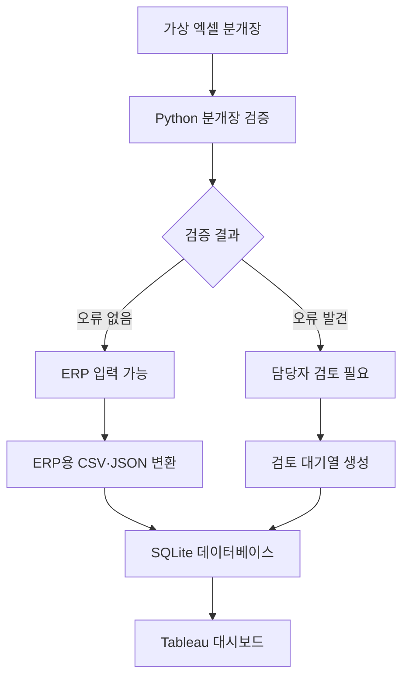

# 회계 분개장 자동 분석 및 ERP 변환

월별 Excel 분개장의 구조와 열 이름을 분석하고, 회계 오류를 검증해 **ERP 업로드용 파일 생성 및 연동 준비**를 수행하는 Streamlit 프로그램입니다.

## 개발 배경
회계 분개장을 ERP에 옮기기 전에 반복적으로 확인하던 날짜, 계정과목, 부서, 거래처, 금액과 증빙 정보를 사전 검증합니다. 실제 ERP 전표 등록이나 자동 승인은 수행하지 않습니다.

## 주요 기능과 흐름
Excel 업로드 → 시트·헤더·범위 선택 → 가로형/세로형 감지 → 별칭 매핑·수동 수정 → 표준화 → 회계 검증 → 상태 분류 → 날짜별 장부 → ERP CSV·Excel·JSON → SQLite 이력 저장 → 다운로드.

- 정확한 별칭을 먼저 매핑하므로 원본 열 순서가 달라도 동작합니다.
- 상태는 `자동 확정`, `확인 필요`, `미매핑`입니다. 확인이 필요한 제안은 사용자가 선택해야 적용됩니다.
- 미매핑 값과 분석에서 분리한 반복 헤더·합계행은 `source_details.xlsx`와 DB에 보존합니다.
- 회사별 매핑을 JSON으로 다운로드하고 다음 업로드에서 불러올 수 있습니다.
- 가로형은 2개를 초과하는 차변·대변 계정도 처리합니다. 세로형은 같은 전표번호를 전표 단위로 묶습니다.
- 금액은 정수 원 단위로 처리하고 세액은 Decimal로 계산합니다.
- 정상/전체 일계표와 합계, 날짜별 조회, 페이지별 표, 이전 실행 조회를 제공합니다.

## 프로젝트 구조
```text
app.py                          업로드·설정·매핑 편집 화면
config/column_aliases.json       가로형·세로형 열 별칭
config/validation_rules.json     필수값·금액·세금·심각도 정책
src/file_analyzer.py             시트·헤더·범위 분석
src/column_mapper.py             자동·수동 매핑과 JSON 재사용
src/data_standardizer.py         원본 보존과 가로형·세로형 정규화
src/journal_values.py            공통 코드·날짜·정수 금액 처리
src/journal_validator.py         검증과 상태 분류
src/daily_ledger.py              좌우 장부·일계표·전체 합계
src/prepare_erp_upload.py        ERP 분개·JSON·변환 후 재검증
src/result_exporter.py           Excel 서식과 결과 파일
src/adaptive_pipeline.py         표준화·검증 실행
src/adaptive_erp_export.py       전체 파일 생성
src/adaptive_database.py         SQLite 원자적 저장·이력 조회·CLI
src/dashboard.py                결과 대시보드·다운로드
src/file_storage.py              원본 업로드 저장
src/settings.py                 공통 경로
sql/history_schema.sql          새 실행 이력 테이블(기존 테이블 보존)
tests/                          회귀·경계값·통합·UI 테스트
tests/fixtures/                 사용자 자료와 독립적인 합성 Excel
docs/                           사용법·규칙·스키마·구현 보고
```
기존 노트북·샘플·Tableau와 구버전 SQL·실행 함수는 보존합니다.

## 설치
Python 3.12를 기준으로 검사합니다.
```bash
python3.12 -m venv .venv
source .venv/bin/activate
python -m pip install -r requirements.txt
# 개발·테스트 환경
python -m pip install -r requirements-dev.txt
```

## 실행
프로젝트 루트에서 실행합니다.
```bash
python -m streamlit run app.py
python -m src.adaptive_database 입력파일.xlsx
python src/run_pipeline.py 입력파일.xlsx
```
선택 설정 예시:
```bash
python -m src.adaptive_database 입력파일.xlsx --sheet "분개장" --header-row 3 \
  --data-start 4 --data-end 1003 --layout wide \
  --period-start 2026-08-01 --period-end 2026-09-01 \
  --output-dir work/새로운실행/results --database-path work/새로운실행/history.db
```
헤더·범위 인자는 Excel 기준 1부터 시작합니다. 종료일은 회계기간에 포함하지 않습니다.
웹 화면에서는 추정 회계기간을 확인·수정합니다. CLI에서 생략하면 가장 많은 거래가 속한 월을 사용하며, 유효한 날짜가 하나도 없으면 실행 월을 사용하고 날짜 오류를 기록합니다.

기본 결과는 입력 파일명 아래 고유 폴더에 저장하며 같은 파일을 다시 실행해도 이전 결과를 보존합니다. 직접 지정한 출력 폴더에 파일이 있으면 덮어쓰지 않고 중단합니다.
새 DB 기본 경로는 `data/processed/accounting_history.db`입니다. 과거 `adaptive_accounting_erp.db`와 `accounting_erp.db`는 보존합니다.
`python src/run_pipeline.py --legacy-demo`는 과거 고정 샘플·Tableau 재현용 옵션입니다. 구버전 CSV를 갱신하므로 현재 업무에는 파일 인자를 주는 기본 실행을 사용하세요. 구버전 DB 적재는 기존 파일이 있을 때 새 DB를 만들며, 삭제 후 재적재는 함수의 `replace_existing=True`로 명시해야만 가능합니다.

## 입력 파일 조건
- `.xlsx`, `.xlsm`을 지원합니다. `.xls`, 암호화 문서는 지원하지 않습니다. 매크로를 실행하지 않습니다.
- 제목행·여러 시트·반복 헤더·명시적인 합계행을 분석하고, 화면에서 시트와 범위를 수정할 수 있습니다.
- 가로형: 전표당 한 행, 차변/대변 계정과 금액 쌍. 세로형: 전표당 여러 행, 계정코드 및 차변/대변 금액(또는 차대 구분+금액).
- 기본 필수값: 전표번호, 날짜, 부서, 거래처, 증빙유형, 증빙번호, 적요. 회사 규칙은 설정 파일로 조정합니다.
- 코드의 선행 0이 중요하면 Excel에서 텍스트로 저장해야 합니다.
- 수식 셀은 Excel에서 계산·저장한 값이 있어야 합니다. 병합된 다단 헤더와 한 시트의 서로 다른 여러 표는 범위를 선택하거나 단일 헤더로 정리해야 합니다.
- 소수·무한대·부울 금액은 차단합니다. 기본 정책은 음수와 전표 전체 0원도 차단합니다. 쉼표와 원 기호는 허용합니다.

## 검증 규칙과 상태
필수값·가로형 전표번호 중복·기준정보 존재 및 활성 상태·금액 해석·음수·차대 균형·전표 합계·공급가액/부가세/총액·세액·증빙 중복·날짜·기간·계정/금액 쌍을 검사합니다.

| 오류 수준 | 처리 상태 | ERP 대상 |
|---|---|---|
| ERROR 존재 | 입력 불가 | 제외 |
| ERROR 없이 WARNING 존재 | 검토 필요 | 제외 |
| ERROR/WARNING 없음(INFO만 포함 가능) | 입력 가능 | 포함 |

`legacy_processing_status`는 검토 필요와 입력 불가를 과거의 검토 필요 상태로 합칩니다.
증빙 중복은 서로 다른 전표가 같은 증빙을 사용하는 경우 모든 관련 전표를 보류합니다. 세로형의 같은 전표 내 증빙 반복은 허용합니다.
기본 세율은 10%, 원 단위 반올림은 ROUND_HALF_UP입니다. 면세·영세율은 0%로 설정되어 있으며 사용자 회계정책에 맞게 `validation_rules.json`을 검토해야 합니다. 법정 세무 판단이나 모든 세무 예외를 자동 결정하는 기능은 아닙니다.

## 출력 파일
| 파일 | 내용 |
|---|---|
| erp_upload.xlsx / .csv / .json | 입력 가능한 전표만 담은 세로형 분개 |
| review_queue.xlsx / .csv | 검토 필요·입력 불가 전표와 오류 상세 |
| validation_errors.xlsx / .csv | 행 번호·필드·심각도·원인 |
| daily_ledger.xlsx | 좌우 분개장, 정상/전체 일계표와 최종 합계 |
| processing_summary.xlsx / .csv | 전체·정상·경고·입력 불가 건수 |
| source_details.xlsx | 원본 시트 값·미매핑 값·분리한 행 |
| standardized_journal.xlsx | 여러 계정 쌍을 보존한 표준 분개장 |
| column_mapping.csv | 적용 매핑과 신뢰도 |
| erp_balance_check.csv / erp_summary.csv | ERP 변환 후 재검증 |

Excel에는 헤더 고정, 필터, 열 너비, 날짜·금액 표시, 금액 열 인접 배치, 합계행과 상태별 강조를 적용합니다.
일별 집계는 날짜를 읽을 수 있는 전표만 포함합니다. 전체 기간 최종 합계에는 날짜 오류 전표의 읽을 수 있는 금액도 포함합니다. 해석할 수 없는 금액은 `금액 확인 건수`로 명시하며 임의의 정상 금액으로 고치지 않습니다.

## 화면 구성
파일 정보 → 시트·헤더·범위·분개 형태 → 매핑 편집·설정 JSON → 회계기간 → 실행 → KPI·상태별 전표 → 오류·부서·거래처 집계 → 날짜별 추이와 일계표 → ERP 결과 → 다운로드.
상단에서 이전 실행 이력 화면으로 전환할 수 있습니다. 표는 100행 단위로 조회합니다.

## 테스트
활성화한 가상환경에서 `python -m pip install -r requirements-dev.txt`로 pytest를 설치한 뒤 실행합니다.
`requirements.txt`는 실행 의존성, `requirements-dev.txt`는 실행 의존성과 pytest를 관리합니다.

```bash
# 전체 회귀·통합 테스트
python -m pytest -q
# validator 정상·오류·경계값 테스트만 상세 실행
python -m pytest tests/test_validation_extended.py -v
```

QA 테스트는 기존 `src/`와 `tests/` 구조를 유지하며 아래 역할로 구분합니다.

| 구분 | 테스트 파일 | 주요 검증 |
| --- | --- | --- |
| Validator 단위 테스트 | `tests/test_validation_extended.py` | 정상 전표, 원본 불변성, 필수값·코드·금액·날짜 오류, 중복, 심각도별 상태 |
| 경계값 테스트 | `tests/test_validation_extended.py` | 회계기간 시작 포함·종료 제외, -1·0·1원, 정수 금액 상한과 초과, 세액 허용오차·0.5원 반올림, 빈 입력 |
| 회귀 테스트 | `tests/test_regression.py` | 기존 500건 정답표, ERP 금액 보존, 일별·월별 합계 |
| 통합 테스트 | 나머지 `tests/test_*.py` | Excel 구조·매핑, 파이프라인, 파일 출력, DB 원자성, 대시보드, import |

Validator 단위 테스트는 메모리에서 만든 최소 전표와 마스터를 사용합니다. 검증 정책은 기존 `config/validation_rules.json`을 따르며, 정책별 테스트만 해당 설정을 개별 변경합니다. 합성 Excel 재생성은 테스트 실행에 필요하지 않습니다.
테스트는 기존 샘플을 읽기 전용으로 사용하고 임시 폴더에 출력합니다. 500건 샘플의 기존 오류 50개를 모두 탐지하며, 강화된 복합 오류·증빙 중복 정책에서는 오류 66개, 입력 가능 449건, 입력 불가 51건, ERP 1,347행이 기준입니다. 이 수치는 해당 통제된 샘플의 결과이며 일반적인 실제 업무 정확도를 보장하는 수치는 아닙니다.

## 데이터 보존과 Git
기존 파일과 DB는 삭제하지 않습니다. `.env`, DB, 업로드 원본, 처리 결과, 개인 매핑 설정은 Git 제외 대상입니다. 이미 추적된 기존 DB는 디스크에 보존하고 Git 인덱스에서 추적 해제했습니다. 과거 커밋에 포함된 자료를 소급 삭제하지는 않습니다.

## ERP 연동 범위와 향후 개선
현재 범위는 **ERP 업로드용 파일 생성 및 연동 준비**입니다. 실제 ERP 자동 전기는 ERP API, 업로드 양식, DB 인터페이스 또는 RPA 환경이 확보된 후 추가할 수 있습니다.
필요 정보: ERP 제품·버전, 필수 열과 코드 체계, 회사·사업장·회계기간, 승인 절차, 세무·반올림 정책, 인증 방식, 테스트 환경과 결과 회신 규격.
현재 외부 ERP 접속·사용자 인증·승인 워크플로·세무신고는 구현하지 않습니다. 대형 파일은 메모리에서 처리하며 스트리밍·다중 사용자 운영은 향후 확장 대상입니다. 단일 금액은 정확한 Excel·브라우저 표시 범위(2^53-1원)로 제한합니다.


<details>
<summary>초기 구현 기록 — 아래 내용은 구버전의 당시 상태입니다</summary>

# 회계 분개장 ERP 입력 검증 자동화

엑셀 분개장의 입력 오류를 자동으로 검증하고, 정상 전표를 ERP 업로드용 CSV·JSON으로 변환하는 제조기업 회계업무 지원 프로젝트이다.

검증 결과는 SQLite 데이터베이스에 저장하고 Tableau 대시보드에서 처리 현황과 오류 내역을 확인할 수 있도록 구성한다.

## 1. 프로젝트 배경

경영사무 인턴 당시 엑셀 분개장을 확인하면서 거래일자, 계정과목, 차변·대변 금액, 거래처, 적요, 부가세 및 증빙정보를 ERP에 직접 입력했다.

반복적인 수작업 입력 과정에서는 다음 문제가 발생할 수 있었다.

* 기준정보에 없는 계정과목·거래처·부서 입력
* 차변과 대변 금액 불일치
* 부가세 계산 오류
* 증빙번호 중복 및 필수값 누락
* 회계기간을 벗어난 거래 입력
* 검토 대상과 입력 가능 전표의 수작업 분류

이러한 경험을 바탕으로 엑셀 분개장을 사전 검증하고, 정상 전표와 검토 필요 전표를 자동으로 분리하는 시스템을 구현했다.

## 2. 프로젝트 목표

* 엑셀 분개장의 주요 입력 오류 자동 검증
* 오류가 없는 전표와 검토가 필요한 전표 분리
* 정상 전표를 ERP 입력용 행 구조로 변환
* ERP 연계용 CSV 및 JSON 생성
* 검증 결과의 데이터베이스 저장
* 처리 현황과 검토 대기열의 BI 대시보드 제공

본 프로젝트는 ERP에 직접 전표를 등록하는 시스템이 아니라, ERP 입력 전 단계에서 데이터 품질을 검사하고 업로드 데이터를 준비하는 지원 시스템이다.

## 3. 전체 처리 흐름


```mermaid
flowchart TD
    A[가상 엑셀 분개장] --> B[Python 분개장 검증]
    B --> C{검증 결과}
    C -->|오류 없음| D[ERP 입력 가능]
    C -->|오류 발견| E[담당자 검토 필요]
    D --> F[ERP용 CSV·JSON 변환]
    E --> G[검토 대기열 생성]
    F --> H[SQLite 데이터베이스]
    G --> H
    H --> I[Tableau 대시보드]
```

## 4. 주요 기능

### 기준정보 검증

* 계정과목 코드 존재 여부
* 거래처 코드 존재 여부
* 부서 코드 존재 여부
* 비활성 기준정보 사용 여부

### 회계 데이터 검증

* 차변 합계와 대변 합계 일치 여부
* 전표 총금액과 분개 합계 일치 여부
* 공급가액 기준 부가세 계산 여부
* 회계기간 포함 여부

### 입력 품질 검증

* 필수값 누락 여부
* 증빙번호 중복 여부
* 전표번호 중복 여부

### ERP 입력 데이터 생성

* 검증 통과 전표만 ERP 입력 대상으로 분리
* 한 행으로 구성된 엑셀 분개장을 ERP용 분개 행으로 변환
* CSV 및 JSON 형식 저장
* 변환 후 차변·대변 재검증

### 데이터베이스 및 BI

* 기준정보, 원본 전표, 오류 내역, ERP 전표 저장
* 외래키 무결성 검사
* 처리 상태, 오류 유형, 부서별 검토율 집계
* Tableau 검토 대기열 제공

## 5. 사용 기술

| 구분       | 기술                                  |
| -------- | ----------------------------------- |
| 개발 언어    | Python 3.12                         |
| 데이터 처리   | pandas, NumPy                       |
| Excel 처리 | openpyxl                            |
| 데이터 형식   | CSV, Excel, JSON                    |
| 데이터베이스   | SQLite, SQL                         |
| 시각화      | Tableau Public                      |
| 개발 환경    | VS Code, Jupyter Notebook, Anaconda |

SQLite는 별도의 서버 없이 전체 처리 구조를 재현하기 위해 사용했다. 실제 운영환경에서는 Oracle 또는 MS-SQL 구조로 확장할 수 있다.

## 6. 가상 데이터 구성

실제 회사의 회계자료나 개인정보는 사용하지 않았다.

가상의 자동차부품 제조기업을 기준으로 다음 데이터를 구성했다.

* 계정과목: 22개
* 거래처: 12개
* 부서: 7개
* 분개장 전표: 500건
* 의도적으로 주입한 오류: 50건

정상 전표를 먼저 생성한 뒤 서로 다른 전표에 오류를 하나씩 주입해 검증 결과를 비교했다.

## 7. 검증 결과

| 지표            |     결과 |
| ------------- | -----: |
| 전체 전표         |   500건 |
| 주입 오류         |    50건 |
| 탐지 오류         |    50건 |
| 정상 탐지         |    50건 |
| 미탐지           |     0건 |
| 추가 탐지         |     0건 |
| ERP 입력 가능     |   450건 |
| 검토 필요         |    50건 |
| ERP 분개 행      | 1,350행 |
| 차변·대변 불일치 전표  |     0건 |
| 데이터베이스 외래키 오류 |     0건 |

정밀도와 재현율은 모두 100%로 확인됐다.

단, 이 수치는 직접 정의하고 주입한 오류를 대상으로 측정한 통제된 테스트 결과이다. 실제 기업의 다양한 예외 상황에 대한 일반적인 성능을 의미하지 않는다.

## 8. Tableau 대시보드


대시보드에서는 다음 정보를 확인할 수 있다.

* 전체·입력 가능·검토 필요 전표 수
* 전체 전표 대비 검토 필요 비율
* 처리 상태별 전표 수
* 오류 유형별 발생 건수
* 부서별 검토 필요 비율
* 전표별 오류 상세내용

## 9. 프로젝트 구조

```text
accounting_erp_automation/
├── dashboard/
│   ├── data/
│   └── accounting_erp_dashboard.twbx
├── data/
│   ├── expected/
│   ├── master/
│   ├── processed/
│   └── raw/
├── docs/
│   └── project_plan.md
├── notebooks/
│   ├── 01_create_journal_template.ipynb
│   ├── 02_validate_master_data.ipynb
│   ├── 03_create_error_data.ipynb
│   ├── 04_validate_journal.ipynb
│   ├── 05_prepare_erp_upload.ipynb
│   └── 06_generate_bulk_journal.ipynb
├── outputs/
├── sql/
│   ├── schema.sql
│   └── analysis_queries.sql
├── src/
│   ├── journal_validator.py
│   ├── prepare_erp_upload.py
│   ├── load_database.py
│   ├── export_dashboard_data.py
│   └── run_pipeline.py
├── README.md
└── requirements.txt
```

## 10. 실행 방법

### 패키지 설치

```bash
python -m pip install -r requirements.txt
```

### Streamlit 웹 화면 실행

```bash
python -m streamlit run app.py
```

Excel 업로드, 구조·열 매핑 확인, 검증, ERP 변환, SQLite 저장과 결과 다운로드를 제공한다.
시트·범위 선택, 수동 매핑과 가로형·세로형 입력을 지원한다.

### 업로드 파일 기준 CLI 실행

```bash
python -m src.adaptive_database data/raw/journal_korean_headers.xlsx
```

기존 `python src/adaptive_database.py 파일.xlsx` 실행도 지원한다.
기본 결과는 `data/processed/adaptive/<입력 파일명>/` 아래 실행별 고유 폴더에 저장하며, DB는 `data/processed/accounting_history.db`이다.
출력 위치를 직접 지정하려면 아래처럼 사용한다. 이미 파일이 있는 출력 폴더는 덮어쓰지 않고 중단한다.

```bash
python -m src.adaptive_database data/raw/bulk_journal.xlsx \
  --output-dir work/stage1-manual-run/results \
  --database-path work/stage1-manual-run/history.db
```

이 예시도 재실행 시 새로운 출력 폴더명을 지정해야 결과 파일을 보존할 수 있다.

### 개발 의존성 및 테스트

Python 3.12 환경을 기준으로 검증한다.

```bash
python -m pip install -r requirements-dev.txt
python -m pytest
```

테스트는 기존 샘플을 읽고 임시 폴더에 결과와 DB를 저장한다. 기존 데이터와 운영 DB는 변경하지 않는다.
500건 오류 정답 비교, ERP 금액 보존, 날짜별 집계, 한글 헤더와 열 순서 변경, SQLite 이력 및 import 호환성을 검증한다.
미매핑 열과 열 순서 변경도 회귀 테스트에서 확인한다. Validator 정상·오류·경계값 검사 범위와 개별 실행 명령은 상단의 테스트 절을 참고한다.

### 기존 고정 샘플·Tableau 파이프라인 실행

```bash
python src/run_pipeline.py
```

기존 명령은 `bulk_journal.xlsx`와 2026년 8월 기준을 사용하며, 기존 결과와 샘플 DB 내용을 갱신한다. 업로드 파일 처리는 위의 CLI 또는 웹 화면을 사용한다.

전체 실행 과정은 다음 순서로 진행된다.

1. 분개장 오류 검증
2. ERP 업로드 데이터 변환
3. SQLite 데이터베이스 적재
4. Tableau 대시보드용 데이터 생성

실행 완료 후 Tableau에서 데이터 원본을 새로 고치면 최신 결과가 반영된다.

## 11. 주요 출력 파일

| 파일                            | 설명                  |
| ----------------------------- | ------------------- |
| `bulk_validation_result.csv`  | 전표별 오류 탐지 결과        |
| `bulk_transaction_status.csv` | 입력 가능·검토 필요 상태      |
| `bulk_review_queue.csv`       | 담당자 검토 대기열          |
| `bulk_erp_upload.csv`         | ERP 업로드용 분개 행       |
| `bulk_erp_upload.json`        | ERP 연계용 JSON        |
| `accounting_erp.db`           | SQLite 데이터베이스       |
| `dashboard/data/*.csv`        | Tableau 시각화용 집계 데이터 |

## 12. 한계와 개선 방향

* 실제 ERP API와 직접 연동하지 않고 업로드 파일 생성까지만 구현
* 가상 제조기업 데이터와 사전에 정의한 오류를 사용
* 복합전표와 예외적인 세무처리 규칙은 제한적으로 반영
* 사용자 권한, 승인 이력 및 수정 이력 관리 미구현

향후에는 다음 기능으로 확장할 수 있다.

* Oracle 또는 MS-SQL 기반 운영 데이터베이스 전환
* 계정과목 및 거래처 자동완성
* 적요 기반 계정과목 추천
* 담당자 승인 및 수정 이력 관리
* ERP API 또는 RPA 입력 연계
* 이메일·메신저 오류 알림

</details>
