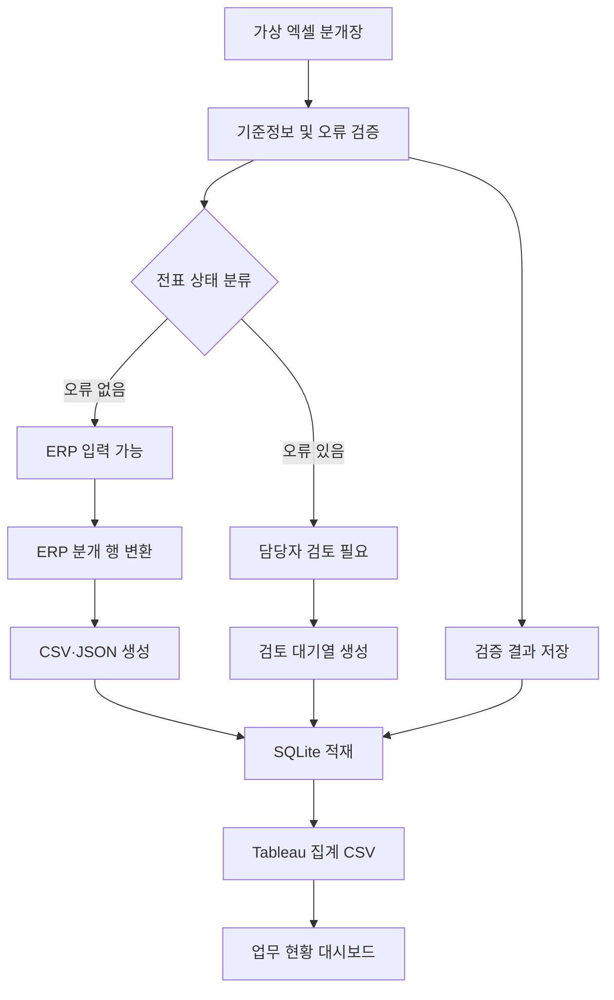

# 시스템 개선 구현 보고

기존 분석·매핑·표준화·검증·ERP·일계표 모듈과 샘플·노트북·Tableau를 유지하면서 함수를 단계별로 개선했습니다.

## 단계별 내용
1. README·의존성·앱·설정·소스·SQL·기준정보·문서·테스트와 Git 상태를 확인했습니다. 이전 import 개선 작업과 미추적 사용자 파일을 보존했습니다.
2. settings/file_storage로 경로와 원본 저장을 분리하고 app/dashboard로 입력 화면과 결과 표시를 분리했습니다.
3. 헤더 별칭 점수, 시트·범위 선택, 원본 행 번호, 반복 헤더·명시적 합계행 분리 보존을 구현했습니다.
4. 정확한 매핑 선확정, 중복 방지, 수동 적용, JSON 재사용, 세로형 및 임의 개수 계정 쌍, 미매핑 값 보존을 구현했습니다.
5. 정수·Decimal 금액 처리, 20개 요구 검증 항목, severity, 세 상태, 날짜순 장부, 정상/전체 합계를 구현했습니다.
6. 정상 전표만 ERP 변환·재검증하고 CSV·JSON·서식 있는 Excel을 생성합니다. 빈 입력과 정상 0건도 처리합니다.
7. 기존 테이블을 보존하는 실행 이력 스키마와 원자적 INSERT, 읽기 전용 이력 조회, UI 편집·KPI·차트·필터·페이지·다운로드를 연결했습니다.
8. 회귀·경계값·DB 실패·UI 테스트와 합성 1,000/5,000행 실실행을 진행하고 결과를 별도 검증 폴더에 기록합니다.

## 의도적으로 달라진 결과
기존 증빙 중복 검사는 두 번째 등장부터 보류했습니다. 현재는 같은 증빙을 사용하는 모든 전표를 보류합니다. 기존 500건 샘플은 입력 가능 449건, 입력 불가 51건, 오류 66건, ERP 1,347행입니다. 원래 주입한 오류 50개를 모두 포함합니다.
구버전 상태가 필요한 연계 코드는 legacy_processing_status를 사용할 수 있습니다.

## 보존
사용자 입력·기준정보·기존 DB·기존 출력·Tableau·노트북을 수정하지 않습니다. 기존 DB 파일은 Git 추적만 해제하고 디스크에는 보존합니다. 새 코드·문서·테스트 외의 관련 없는 파일은 변경하지 않습니다.

## 범위
ERP 업로드용 파일 생성 및 연동 준비를 구현했습니다. 실제 ERP 자동 전기는 ERP API, 업로드 양식, DB 인터페이스 또는 RPA 환경이 확보된 후 추가할 수 있습니다.


## 최종 검증 결과 (2026-09-23)

1. 발견한 문제: 직접 실행·패키지 import 혼용, 데모 고정 파일 경로, 불확실한 매핑의 선점, 가로형 고정 계정 쌍, 잘못된 금액의 누락 위험, 기존 DB 초기화, 결과 덮어쓰기, UI와 처리 로직 결합 및 대용량 반복 복사 비용을 확인했습니다.
2. 유지한 기능: 기존 구조 분석·별칭 매핑·표준화·회계 검증·ERP 변환·일계표를 확장했습니다. 기존 사용자 입력, 마스터, DB, 출력 데이터는 시작 시점 SHA256과 동일합니다. 데모/레거시 진입점과 과거 문서 기록도 보존했습니다.
3. 변경 파일(이번 전체 개선 시작 시점 기준):
- `.gitignore`
- `README.md`
- `app.py`
- `config/column_aliases.json`
- `docs/data_dictionary.md`
- `docs/project_implementation_report.md`
- `docs/system_flow.md`
- `docs/validation_rules.md`
- `src/adaptive_database.py`
- `src/adaptive_erp_export.py`
- `src/adaptive_pipeline.py`
- `src/column_mapper.py`
- `src/daily_ledger.py`
- `src/data_standardizer.py`
- `src/file_analyzer.py`
- `src/journal_validator.py`
- `src/load_database.py`
- `src/prepare_erp_upload.py`
- `src/run_pipeline.py`
- `tests/test_imports.py`
- `tests/test_pipeline.py`
- `tests/test_regression.py`

4. 신규 파일(미추적 기존 파일과 구분):
- `config/validation_rules.json`
- `docs/database_schema.md`
- `docs/user_guide.md`
- `sql/history_schema.sql`
- `src/dashboard.py`
- `src/file_storage.py`
- `src/journal_values.py`
- `src/result_exporter.py`
- `src/settings.py`
- `tests/fixtures/README.md`
- `tests/fixtures/generate_examples.py`
- `tests/fixtures/vertical_1000_rows.xlsx`
- `tests/fixtures/wide_1000.xlsx`
- `tests/fixtures/wide_5000.xlsx`
- `tests/test_dashboard_results.py`
- `tests/test_database_atomic.py`
- `tests/test_excel_structure.py`
- `tests/test_export_extended.py`
- `tests/test_mapping_profiles.py`
- `tests/test_validation_extended.py`

5. 단계별 구현: 앞의 1~8단계 내용을 구현·검증했습니다. 최종 성능 점검에서 사용하지 않는 DataFrame 메타데이터의 반복 복사와 날짜 형식 재추정을 줄였습니다. 원본 행 번호·미매핑 자료는 별도 결과에 계속 보존됩니다.
6. 검증 명령:

```bash
python -m pytest -q -p no:cacheprovider
python -m py_compile app.py src/*.py tests/*.py tests/fixtures/*.py
python -m src.adaptive_database tests/fixtures/wide_1000.xlsx --output-dir <새로운_결과폴더> --database-path <검증용_DB>
```

실제 최종 검증은 py_compile.compile(doraise=True)로 app/src/tests의 32개 Python 파일을 검사하고 run_and_save를 통해 아래 모든 파일을 끝까지 처리했습니다.
7. 테스트: **65 passed, 159 warnings (34.15초)**. 경고는 protobuf/Altair/jsonschema의 폐기 예정 API와 pandas 테스트의 fillna 동작 변경 안내입니다. 문법 검사 32개 파일 통과. Streamlit 초기 화면 및 업로드·실행 버튼·KPI 표시 AppTest 통과. HTTP /_stcore/health 응답 ok.
8. 샘플 파일 실행 결과:

| 파일 | 전표 | 입력 가능 | 입력 불가 | 오류 | ERP 행 | 처리 초 |
|---|---:|---:|---:|---:|---:|---:|
| bulk_journal.xlsx | 500 | 449 | 51 | 66 | 1347 | 1.39 |
| journal_korean_headers.xlsx | 500 | 449 | 51 | 66 | 1347 | 1.4 |
| wide_1000.xlsx | 1000 | 1000 | 0 | 0 | 4000 | 3.18 |
| wide_5000.xlsx | 5000 | 5000 | 0 | 0 | 20000 | 16.52 |
| vertical_1000_rows.xlsx | 500 | 500 | 0 | 0 | 1000 | 1.9 |

동일 SQLite에 5회 실행 누적 저장, PRAGMA foreign_key_check 결과 0건. 실행 로그·결과 파일·검증 JSON은 `work/final-optimized-20260923-111141/`에 보관했습니다. 시간은 현재 컴퓨터의 측정값이며 환경에 따라 달라집니다.

9. 화면 실행: 프로젝트 폴더에서 `python -m streamlit run app.py`. 현재 로컬 주소는 http://127.0.0.1:8501 입니다.
10. 생성 파일: erp_upload.xlsx/csv/json, review_queue.xlsx, validation_errors.xlsx, daily_ledger.xlsx, processing_summary.xlsx, source_details.xlsx 및 호환용 CSV. 정상·전체 일계표와 합계는 daily_ledger.xlsx의 별도 시트에 저장됩니다.
11. 실제 ERP 연결에 필요한 정보: ERP 제품·버전, 확정 업로드 양식/필수 코드, API·DB 인터페이스·RPA 접근 방법, 인증 및 권한, 테스트 환경, 중복 전기 방지·취소·재시도 정책. 현재 범위는 **ERP 업로드용 파일 생성 및 연동 준비**입니다.
12. 제한사항: xlsx/xlsm만 지원하며 암호화 문서와 매크로 실행은 지원하지 않습니다. 병합·다단 헤더는 범위와 매핑을 사용자가 확인해야 합니다. 금액은 정수 원 기준이고 세무 예외는 회사 정책 설정이 필요합니다. 모든 파일을 메모리에서 처리하므로 초대형 파일과 다중 사용자 운영에는 추가 설계가 필요합니다. 회사별 매핑은 JSON 다운로드·재업로드 방식입니다. 외부 ERP 자동 전기·인증·승인 워크플로는 구현 범위에 포함하지 않습니다.

기존 data/processed/accounting_erp.db는 Git 추적만 해제했으며 디스크 파일은 그대로 유지했습니다. 커밋은 생성하지 않았습니다.

<details>
<summary>초기 구현 기록 — 아래 내용은 구버전의 당시 상태입니다</summary>

# 회계 분개장 ERP 입력 검증 자동화 프로젝트 종합 구현 보고서

## 1. 보고서 목적

본 보고서는 `accounting_erp_automation` 프로젝트를 진행하면서 구성한 데이터, 프로그램, 데이터베이스, 대시보드, 문서 및 GitHub 저장소의 역할과 연결 관계를 종합적으로 정리한다.

이 보고서의 목적은 단순히 결과물 목록을 남기는 것이 아니다. 시간이 지난 뒤 프로젝트를 다시 보더라도 다음 내용을 스스로 설명할 수 있도록 하는 데 목적이 있다.

- 왜 이 프로젝트를 시작했는가
- 어떤 업무 문제를 해결하려 했는가
- 어떤 데이터와 기준정보를 만들었는가
- 각 파일은 왜 존재하며 어떤 역할을 하는가
- 데이터가 어떤 순서로 처리되는가
- 정상 전표와 오류 전표를 어떻게 구분하는가
- ERP 업로드 데이터, SQLite 데이터베이스, Tableau 대시보드가 어떻게 연결되는가
- 자동화가 담당하는 범위와 회계 담당자가 최종적으로 확인해야 하는 범위는 무엇인가
- 검증 결과를 어떻게 측정했으며 결과를 어디까지 신뢰할 수 있는가
- 현재 구현의 한계와 앞으로 확장할 수 있는 방향은 무엇인가

## 2. 프로젝트 한눈에 보기

### 2.1 프로젝트명

회계 분개장 ERP 입력 검증 자동화

### 2.2 프로젝트 성격

가상의 자동차부품 제조기업을 배경으로 엑셀 분개장의 입력 오류를 사전에 검증하고, 검증을 통과한 전표를 ERP 업로드용 CSV·JSON으로 변환하며, 처리 결과를 SQLite와 Tableau로 관리하는 회계업무 지원 프로젝트이다.

### 2.3 핵심 목적

반복적인 ERP 전표 입력 과정에서 발생할 수 있는 오류를 실제 등록 전에 발견하고, 정상 전표와 담당자 검토가 필요한 전표를 자동으로 구분하는 것이 핵심 목적이다.

### 2.4 핵심 결과

| 항목 | 결과 |
|---|---:|
| 가상 분개장 전표 | 500건 |
| 의도적으로 주입한 오류 | 50건 |
| 탐지한 오류 | 50건 |
| 정상 탐지 | 50건 |
| 미탐지 | 0건 |
| 추가 탐지 | 0건 |
| ERP 입력 가능 전표 | 450건 |
| 담당자 검토 필요 전표 | 50건 |
| 생성한 ERP 분개 행 | 1,350행 |
| 변환 후 차변·대변 불일치 전표 | 0건 |
| 데이터베이스 외래키 오류 | 0건 |
| 통제된 테스트 기준 정밀도 | 100% |
| 통제된 테스트 기준 재현율 | 100% |

정밀도와 재현율 100%는 직접 정의하고 주입한 50건의 오류를 대상으로 한 통제된 테스트 결과이다. 실제 기업에서 발생하는 모든 회계 예외 상황에 대해 100%의 성능을 보장한다는 의미는 아니다.

## 3. 프로젝트를 시작한 배경

경영사무 인턴 당시 엑셀 분개장을 확인하고 거래일자, 계정과목, 차변·대변 금액, 거래처, 적요, 부가세 및 증빙정보를 ERP에 직접 입력했다.

이 과정에서 ERP 입력은 단순히 값을 옮기는 작업이 아니라는 점을 확인했다. 입력 전 다음 내용을 반복적으로 확인해야 했다.

- 계정과목 코드가 회사 기준정보에 존재하는가
- 거래처와 부서 코드가 정확한가
- 차변 합계와 대변 합계가 일치하는가
- 공급가액과 부가세가 기준에 맞게 계산되었는가
- 필수값이 빠지지 않았는가
- 증빙번호나 전표번호가 중복되지 않았는가
- 거래일자가 해당 회계기간에 포함되는가
- 바로 입력해도 되는 전표와 추가 확인이 필요한 전표를 어떻게 구분할 것인가

수작업으로 확인하면 담당자의 숙련도와 집중도에 따라 검토 품질이 달라질 수 있고, 반복 확인에 시간이 많이 소요된다. 이 문제를 해결하기 위해 엑셀 분개장을 Python으로 사전 검증하고, 결과를 ERP 업로드 데이터와 검토 대기열로 분리하는 구조를 설계했다.

## 4. 해결하려는 업무 문제

이 프로젝트가 해결하려는 문제는 크게 네 가지이다.

### 4.1 기준정보 오류

회계 전표에는 회사가 관리하는 계정과목, 거래처, 부서 코드가 사용되어야 한다. 존재하지 않는 코드나 비활성 코드를 입력하면 ERP 등록 과정에서 오류가 발생하거나 잘못된 데이터가 저장될 수 있다.

### 4.2 금액 및 회계 논리 오류

전표는 차변과 대변이 일치해야 한다. 전표 총금액, 공급가액, 부가세도 서로 맞아야 한다. 엑셀 계산이나 수작업 입력 과정에서 금액이 잘못되면 회계 데이터의 신뢰성이 낮아진다.

### 4.3 입력 품질 오류

필수값 누락, 증빙번호 중복, 전표번호 중복, 회계기간을 벗어난 거래는 실제 ERP 입력 전에 발견해야 한다.

### 4.4 검토 대상 분류의 비효율

모든 전표를 담당자가 같은 방식으로 다시 확인하면 시간이 오래 걸린다. 시스템이 오류가 없는 전표와 검토가 필요한 전표를 먼저 구분하면 담당자는 예외 전표에 집중할 수 있다.

## 5. 프로젝트 범위

### 5.1 구현한 범위

- 가상 제조기업 기준정보 생성
- 정상 분개장과 오류 포함 분개장 생성
- 500건 규모의 대량 가상 분개장 생성
- 주요 회계 및 입력 오류 자동 검증
- 전표별 입력 가능·검토 필요 상태 분류
- ERP 업로드용 분개 행 생성
- CSV·JSON 출력
- 검토 대기열 생성
- SQLite 데이터베이스 적재
- SQL 분석 쿼리 작성
- Tableau용 집계 데이터 생성
- Tableau 대시보드 제작
- 전체 단계를 순서대로 실행하는 파이프라인 구성
- 프로젝트 계획서, 시스템 흐름도, 데이터 사전, 검증 규칙 문서 작성
- Git 버전 관리 및 GitHub 공개 저장소 업로드

### 5.2 구현하지 않은 범위

- 실제 회사 ERP 접속
- 실제 ERP API 호출
- ERP에 대한 자동 전표 등록
- 실제 회계자료 또는 개인정보 사용
- 담당자의 최종 회계 판단 자동화
- 사용자 권한 및 승인 워크플로 관리
- 수정 이력과 감사 로그의 완전한 관리

따라서 이 프로젝트는 ERP 자체를 구현한 것이 아니라 ERP 입력 전 데이터 품질을 높이고 업로드 준비를 지원하는 전처리·검증 시스템이다.

## 6. 전체 시스템 구조



이 구조의 핵심은 검증과 실제 입력 준비를 분리한 것이다. 오류가 있는 전표는 ERP 입력용 데이터로 변환하지 않고 검토 대기열로 이동한다. 오류가 없는 전표만 ERP 분개 행으로 변환한다.

## 7. 폴더 구조와 역할

```text
accounting_erp_automation/
├── dashboard/
│   ├── data/
│   ├── accounting_erp_dashboard.png
│   └── accounting_erp_dashboard.twb
├── data/
│   ├── expected/
│   ├── master/
│   ├── processed/
│   └── raw/
├── docs/
├── notebooks/
├── outputs/
├── sql/
├── src/
├── .gitignore
├── README.md
└── requirements.txt
```

### 7.1 `data/`

프로젝트에서 사용하는 원본, 기준정보, 기대값, 처리 결과를 구분하여 저장한다. 데이터의 단계별 위치가 분리되어 있어 원본과 결과가 섞이지 않는다.

### 7.2 `notebooks/`

개발 과정을 단계별로 실험하고 확인한 Jupyter Notebook을 저장한다. 데이터 생성, 기준정보 검증, 오류 주입, 분개장 검증, ERP 변환 과정을 순서대로 확인할 수 있다.

### 7.3 `src/`

반복 실행이 가능한 Python 프로그램을 저장한다. 노트북에서 확인한 처리 과정을 독립된 실행 파일로 정리한 영역이다.

### 7.4 `sql/`

SQLite 데이터베이스의 테이블 구조와 분석용 SQL 쿼리를 저장한다.

### 7.5 `dashboard/`

Tableau 대시보드 파일, 대시보드 이미지, 시각화에 사용하는 집계 CSV를 저장한다.

### 7.6 `docs/`

프로젝트를 다른 사람이 이해하고 유지할 수 있도록 계획, 흐름, 데이터 정의, 검증 기준을 문서화한다.

### 7.7 `outputs/`

전체 검증 및 ERP 변환 결과를 요약한 산출물을 저장한다.

## 8. 입력 데이터 구성

### 8.1 원본 분개장

#### `data/raw/journal_template.xlsx`

분개장에 어떤 항목을 입력해야 하는지 보여주는 기본 양식이다. 프로젝트 초기에 데이터 구조와 입력 항목을 정의하기 위해 존재한다.

#### `data/raw/journal_sample.xlsx`

소량의 정상 데이터를 이용해 처리 흐름을 먼저 시험하기 위한 파일이다. 대량 데이터를 실행하기 전에 코드와 컬럼 구조가 올바른지 확인하는 역할을 한다.

#### `data/raw/journal_with_errors.xlsx`

의도적인 오류가 포함된 소량 테스트 분개장이다. 검증 코드가 각 오류를 제대로 발견하는지 개발 단계에서 확인하기 위해 사용한다.

#### `data/raw/bulk_journal.xlsx`

최종 검증에 사용한 500건 규모의 가상 분개장이다. 포트폴리오의 주요 성능 수치와 Tableau 대시보드는 이 대량 데이터를 중심으로 구성했다.

### 8.2 기준정보

#### `data/master/accounts.csv`

계정코드, 계정명, 계정분류, 정상잔액 방향, 부가세 유형, 사용 여부 등 계정과목 관련 기준을 관리한다. 분개장의 계정코드가 유효한지 판단하는 기준이 된다.

#### `data/master/vendors.csv`

거래처코드, 거래처명, 거래처 유형, 기본 계정과목, 결제 계정, 부가세 적용 여부 등 거래처 기준을 관리한다. 분개장의 거래처가 존재하는지와 거래처 관련 처리 기준을 확인하는 데 사용한다.

#### `data/master/departments.csv`

부서코드, 부서명, 원가중심점, 주요 역할, 사용 여부 등 부서 기준을 관리한다. 부서 코드 검증과 부서별 처리 현황 집계에 사용한다.

### 8.3 기대 결과 데이터

`data/expected/`는 검증 프로그램이 실제로 오류를 제대로 찾았는지 비교하기 위한 정답 데이터 영역이다.

#### `injected_errors.csv`

소량 테스트 데이터에 어떤 오류를 의도적으로 넣었는지 기록한다.

#### `bulk_injected_errors.csv`

500건 대량 데이터에 주입한 50건의 오류 정답을 기록한다.

#### `bulk_normal_reference.xlsx`

오류를 주입하기 전 정상 상태의 대량 분개장 기준본이다. 오류 주입 전후를 비교하거나 정상 데이터 기준을 확인하는 데 사용한다.

#### `bulk_error_summary.csv`

대량 데이터에 주입한 오류를 유형별로 요약한다.

이 영역이 존재하기 때문에 단순히 “오류가 발견됐다”라고 주장하는 데서 끝나지 않고, 주입한 정답과 탐지 결과를 비교하여 미탐지와 추가 탐지를 계산할 수 있다.

## 9. 가상 데이터 설계

실제 회사의 회계자료나 개인정보는 사용하지 않았다. 가상의 자동차부품 제조기업을 기준으로 다음 데이터를 구성했다.

| 데이터 | 규모 |
|---|---:|
| 계정과목 | 22개 |
| 거래처 | 12개 |
| 부서 | 7개 |
| 분개장 전표 | 500건 |
| 의도적 오류 | 50건 |

정상 전표를 먼저 만든 뒤 서로 다른 전표에 오류를 하나씩 주입했다. 이 방식은 어떤 오류를 넣었는지 정답을 명확히 알 수 있고, 검증 결과와 일대일로 비교하기 쉽다는 장점이 있다.

## 10. 노트북별 역할

### 10.1 `01_create_journal_template.ipynb`

분개장 양식과 기본 데이터 구조를 만든다. 프로젝트 전체에서 사용할 컬럼과 입력 형태를 최초로 정의하는 단계이다.

### 10.2 `02_validate_master_data.ipynb`

계정과목, 거래처, 부서 기준정보를 불러오고 데이터 형태와 사용 가능 여부를 확인한다. 이후 분개장 검증이 참조할 기준정보가 정상인지 먼저 확인하는 역할을 한다.

### 10.3 `03_create_error_data.ipynb`

정상 분개장에 의도적인 오류를 추가하고, 어떤 전표에 어떤 오류를 넣었는지 정답 파일을 만든다. 검증 성능을 객관적으로 비교하기 위한 테스트 데이터 제작 단계이다.

### 10.4 `04_validate_journal.ipynb`

분개장의 필수값, 기준정보, 금액, 부가세, 중복, 회계기간 등을 검증하고 오류 목록과 전표 상태를 확인한다.

### 10.5 `05_prepare_erp_upload.ipynb`

검증을 통과한 정상 전표를 ERP 입력에 적합한 분개 행 구조로 변환한다. 오류 전표는 검토 대기열로 분리하고, 변환 후 차변·대변이 다시 일치하는지도 확인한다.

### 10.6 `06_generate_bulk_journal.ipynb`

최종 포트폴리오 검증에 사용할 500건 규모의 대량 가상 분개장과 오류 데이터를 생성한다.

노트북은 각 단계를 직접 확인하고 학습한 기록이다. 반면 `src/`의 Python 파일은 같은 작업을 반복 가능하게 실행하기 위한 프로그램이다.

## 11. Python 실행 파일별 역할

### 11.1 `src/journal_validator.py`

분개장 검증을 담당하는 핵심 파일이다.

주요 역할은 다음과 같다.

- 엑셀 분개장 불러오기
- 계정과목·거래처·부서 기준정보와 비교
- 필수값 확인
- 차변·대변 및 총금액 확인
- 부가세 계산 확인
- 회계기간 확인
- 증빙번호와 전표번호 중복 확인
- 전표별 오류 기록
- 오류 개수를 기준으로 입력 가능·검토 필요 상태 분류
- 검증 결과 및 비교 결과 CSV 생성

이 파일이 잘못된 전표가 다음 단계로 넘어가지 않게 막는 첫 번째 통제 장치이다.

### 11.2 `src/prepare_erp_upload.py`

검증 결과를 바탕으로 ERP 업로드 데이터와 검토 대기열을 만든다.

주요 역할은 다음과 같다.

- 입력 가능 전표만 선별
- 한 행 형태의 엑셀 분개장을 여러 개의 ERP 분개 행으로 변환
- ERP 업로드용 CSV 생성
- 외부 시스템 연계용 JSON 생성
- 검토 필요 전표와 오류 사유를 검토 대기열로 분리
- 변환된 분개 행의 차변·대변 재검증

이 파일의 핵심은 정상 전표와 오류 전표의 처리 경로를 완전히 분리하는 것이다.

### 11.3 `src/load_database.py`

기준정보, 원본 전표, 검증 오류, 정상 ERP 전표, 분개 행을 SQLite 데이터베이스에 적재한다.

주요 역할은 다음과 같다.

- SQL 스키마를 이용한 테이블 준비
- 계정과목·거래처·부서 기준정보 적재
- 원본 전표를 스테이징 영역에 저장
- 검증 오류 저장
- 검증을 통과한 전표만 ERP 대상 테이블에 저장
- 분개 행 저장
- 외래키 무결성 확인

CSV 파일이 개별 결과물이라면 SQLite는 프로젝트의 데이터를 한곳에서 관계형 구조로 관리하는 통합 저장소이다.

### 11.4 `src/export_dashboard_data.py`

SQLite와 처리 결과를 Tableau에서 사용하기 쉬운 집계 CSV로 변환한다.

주요 역할은 다음과 같다.

- 전체 처리 KPI 집계
- 입력 가능·검토 필요 상태별 집계
- 오류 유형별 집계
- 부서별 집계
- 거래처별 집계
- 계정과목별 집계
- 일자별 집계
- 거래 유형별 집계
- 검토 대상 상세 데이터 생성

Tableau가 원본 전표와 복잡한 테이블을 직접 해석하도록 두지 않고, 대시보드 목적에 맞는 데이터로 미리 정리하는 단계이다.

### 11.5 `src/run_pipeline.py`

전체 프로그램을 정해진 순서대로 실행하는 통합 실행 파일이다.

실행 순서는 다음과 같다.

1. 분개장 검증
2. ERP 업로드 데이터 및 검토 대기열 생성
3. SQLite 데이터베이스 적재
4. Tableau 대시보드용 집계 데이터 생성

앞 단계에서 예외가 발생하면 다음 단계를 실행하지 않는다. 이 구조는 검증되지 않은 이전 결과를 사용해 ERP 업로드 파일이나 대시보드 데이터를 새로 만드는 일을 방지한다.

## 12. 검증 규칙

### 12.1 기준정보 검증

- 계정과목 코드 존재 여부
- 거래처 코드 존재 여부
- 부서 코드 존재 여부
- 비활성 기준정보 사용 여부

기준정보 검증은 잘못된 코드가 ERP 입력 대상 데이터와 데이터베이스의 정상 테이블로 들어가는 것을 방지한다.

### 12.2 회계 데이터 검증

- 차변 합계와 대변 합계 일치 여부
- 전표 총금액과 분개 합계 일치 여부
- 공급가액 기준 부가세 계산 여부
- 거래일자의 회계기간 포함 여부

회계 데이터 검증은 전표의 기본적인 금액 논리와 기간 기준을 확인한다.

### 12.3 입력 품질 검증

- 필수값 누락 여부
- 증빙번호 중복 여부
- 전표번호 중복 여부

입력 품질 검증은 형식상 입력은 가능하더라도 실제 업무에서 문제가 될 수 있는 누락과 중복을 발견한다.

### 12.4 상태 분류 기준

| 오류 개수 | 처리 상태 | 후속 처리 |
|---:|---|---|
| 0개 | 입력 가능 | ERP 업로드 데이터로 변환 |
| 1개 이상 | 검토 필요 | 오류 사유와 함께 검토 대기열로 이동 |

오류가 하나라도 있는 전표는 자동으로 수정하거나 ERP 입력 대상으로 넘기지 않는다. 담당자가 원본 증빙과 업무 기준을 확인하도록 보류한다.

## 13. 처리 결과 파일

### 13.1 소량 개발 결과와 대량 최종 결과

`data/processed/`에는 소량 개발 과정의 결과 파일과 `bulk_` 접두사가 붙은 500건 대량 처리 결과가 함께 있다.

- 접두사가 없는 파일: 기능을 단계적으로 만들면서 사용한 소량 테스트 결과
- `bulk_` 파일: 최종 포트폴리오 검증에 사용한 500건 처리 결과

두 종류를 함께 보관하면 소량 테스트에서 대량 처리로 확장한 개발 과정을 확인할 수 있다.

### 13.2 주요 파일의 역할

#### `validation_result.csv` / `bulk_validation_result.csv`

검증 과정에서 발견한 오류를 기록한다. 어떤 전표에서 어떤 오류가 발견되었는지 확인하는 기본 결과 파일이다.

#### `validation_comparison.csv` / `bulk_validation_comparison.csv`

의도적으로 주입한 오류와 프로그램이 탐지한 오류를 비교한다. 정상 탐지, 미탐지, 추가 탐지를 계산하는 근거가 된다.

#### `transaction_status.csv` / `bulk_transaction_status.csv`

각 전표의 오류 개수와 최종 처리 상태를 기록한다. ERP 입력 가능 전표와 검토 필요 전표를 구분하는 기준 파일이다.

#### `review_queue.csv` / `bulk_review_queue.csv`

담당자가 확인해야 하는 전표만 모아 놓은 검토 대기열이다. 오류 유형과 상세 내용을 함께 제공하여 담당자가 확인할 대상을 빠르게 파악할 수 있게 한다.

#### `erp_upload.csv` / `bulk_erp_upload.csv`

검증을 통과한 전표를 ERP 입력용 분개 행으로 변환한 결과이다. 실제 ERP에 직접 등록하는 파일이 아니라 업로드에 사용할 수 있도록 준비한 데이터이다.

#### `erp_upload.json` / `bulk_erp_upload.json`

동일한 ERP 변환 결과를 JSON 형식으로 저장한다. 향후 API나 다른 외부 시스템과 연계할 때 활용할 수 있는 형태이다.

#### `erp_balance_check.csv` / `bulk_erp_balance_check.csv`

ERP 분개 행으로 변환한 후에도 전표별 차변과 대변이 일치하는지 다시 확인한 결과이다. 변환 과정에서 금액 구조가 깨지지 않았음을 확인하는 2차 검증 자료이다.

#### `accounting_erp.db`

기준정보, 원본 전표, 오류, 정상 전표, 분개 행을 통합해 저장한 SQLite 데이터베이스이다.

## 14. 데이터베이스 구조와 역할

데이터베이스는 원본과 검증 결과, 정상 ERP 데이터를 구분해 저장한다.

```text
기준정보
├── accounts
├── vendors
└── departments

원본 및 검증
├── staging_transactions
└── validation_errors

검증 통과 데이터
├── erp_vouchers
└── journal_lines
```

### 14.1 기준정보 테이블

`accounts`, `vendors`, `departments`는 분개장 코드 검증과 ERP 데이터의 참조 기준이 된다.

### 14.2 `staging_transactions`

오류 여부와 관계없이 원본 전표를 보관하는 영역이다. 원본이 어떻게 들어왔는지 확인하고 검증 결과를 추적하기 위해 필요하다.

### 14.3 `validation_errors`

탐지된 오류를 전표와 연결해 저장한다. 하나의 전표에 여러 오류가 있다면 여러 오류 기록과 연결될 수 있다.

### 14.4 `erp_vouchers`

검증을 통과한 전표의 기본 정보를 저장한다. 오류가 있는 전표는 이 테이블에 적재하지 않는다.

### 14.5 `journal_lines`

정상 전표를 차변과 대변의 분개 행 단위로 저장한다. 하나의 ERP 전표에 여러 개의 분개 행이 연결된다.

### 14.6 데이터베이스 설계의 의미

원본은 스테이징에 남기고, 오류는 별도 테이블에 기록하며, 검증 통과 데이터만 ERP 대상 테이블로 이동한다. 이 구조를 통해 원본 추적 가능성과 정상 데이터의 무결성을 함께 확보했다.

## 15. SQL 파일의 역할

### 15.1 `sql/schema.sql`

SQLite에서 사용할 테이블과 관계를 정의한다. Python 코드가 데이터를 저장할 수 있도록 데이터베이스의 기본 틀을 제공한다.

### 15.2 `sql/analysis_queries.sql`

저장된 데이터를 조회하고 처리 상태, 오류, 부서, 거래처 등 업무 현황을 분석하기 위한 SQL 쿼리를 모아 둔다.

SQL 파일을 Python 코드와 분리하면 데이터베이스 구조와 분석 로직을 독립적으로 확인하고 수정할 수 있다.

## 16. Tableau 대시보드 구성

### 16.1 대시보드 파일

#### `dashboard/accounting_erp_dashboard.twb`

Tableau 워크북 파일이다. 시각화 시트, 데이터 연결, 필터 및 대시보드 배치를 저장한다.

#### `dashboard/accounting_erp_dashboard.png`

Tableau가 설치되지 않은 사람도 대시보드 결과를 바로 확인할 수 있도록 저장한 대표 이미지이다. GitHub README에서 프로젝트 결과를 빠르게 보여주는 역할도 한다.

### 16.2 대시보드 데이터 파일

| 파일 | 역할 |
|---|---|
| `dashboard_kpi.csv` | 전체 전표, 입력 가능, 검토 필요 등 핵심 수치 제공 |
| `status_summary.csv` | 처리 상태별 전표 수 집계 |
| `error_type_summary.csv` | 오류 유형별 발생 건수 집계 |
| `department_summary.csv` | 부서별 처리 및 검토 현황 집계 |
| `partner_summary.csv` | 거래처별 처리 현황 집계 |
| `account_summary.csv` | 계정과목별 처리 현황 집계 |
| `daily_summary.csv` | 일자별 전표 처리 현황 집계 |
| `transaction_type_summary.csv` | 거래 유형별 현황 집계 |
| `review_detail.csv` | 담당자가 확인할 전표별 오류 상세 제공 |

### 16.3 대시보드에서 확인할 수 있는 내용

- 전체 전표 수
- ERP 입력 가능 전표 수
- 검토 필요 전표 수
- 전체 전표 대비 검토 필요 비율
- 처리 상태별 전표 수
- 오류 유형별 발생 건수
- 부서별 검토 필요 비율
- 전표별 오류 상세 내용

대시보드는 단순히 예쁜 차트를 만드는 결과물이 아니다. 검증 프로그램이 만든 결과를 담당자가 빠르게 확인하고, 검토 우선순위를 정할 수 있도록 보여주는 업무 화면이다.

## 17. 문서 파일의 역할

### 17.1 `README.md`

GitHub 저장소에 처음 들어온 사람이 프로젝트의 배경, 목적, 기능, 기술, 결과, 실행 방법을 빠르게 이해하도록 만든 대표 소개 문서이다.

### 17.2 `docs/project_plan.md`

프로젝트를 시작한 이유, 해결하려는 문제, 구현 범위, 예상 산출물 등 전체 계획을 정리한다.

### 17.3 `docs/system_flow.md`

엑셀 분개장이 검증되고 ERP 업로드 파일, 데이터베이스, Tableau 데이터로 이어지는 처리 흐름과 자동화·담당자 업무 범위를 설명한다.

### 17.4 `docs/data_dictionary.md`

분개장, 기준정보, 처리 결과 및 데이터베이스에서 사용하는 컬럼과 값의 의미를 설명한다. 같은 컬럼을 다른 사람이 잘못 해석하지 않도록 하는 기준 문서이다.

### 17.5 `docs/validation_rules.md`

어떤 조건을 오류로 판단하는지, 각 검증 규칙의 목적이 무엇인지, 오류 발견 시 어떤 상태로 처리하는지를 정리한다.

이 네 문서는 각각 계획, 처리 구조, 데이터 의미, 검증 기준을 담당한다. 코드만 남겼을 때 부족한 업무 맥락을 보완한다.

## 18. 요약 산출물

### `outputs/validation_summary.csv`

소량 검증 결과를 요약한다.

### `outputs/bulk_validation_summary.csv`

500건 대량 검증 결과를 요약한다.

### `outputs/bulk_erp_upload_summary.csv`

ERP 업로드 데이터 변환 결과를 요약한다.

`data/processed/`가 상세 처리 결과를 보관한다면 `outputs/`는 프로젝트 성과를 빠르게 확인할 수 있는 요약 결과를 제공한다.

## 19. 파일 간 유기적 연결 관계

### 19.1 기준정보와 분개장

`accounts.csv`, `vendors.csv`, `departments.csv`는 `bulk_journal.xlsx`에 입력된 코드가 올바른지 판단하는 기준이다.

### 19.2 오류 정답과 검증 결과

`bulk_injected_errors.csv`는 실제로 주입한 오류 정답이고, `bulk_validation_result.csv`는 프로그램이 탐지한 결과이다. 두 파일을 비교한 결과가 `bulk_validation_comparison.csv`이다.

### 19.3 검증 결과와 상태 분류

전표별 오류 개수를 계산해 `bulk_transaction_status.csv`에 입력 가능 또는 검토 필요 상태를 기록한다.

### 19.4 상태 분류와 ERP 변환

입력 가능 전표는 `bulk_erp_upload.csv`와 `bulk_erp_upload.json`으로 변환한다. 검토 필요 전표는 `bulk_review_queue.csv`로 보낸다.

### 19.5 처리 결과와 데이터베이스

원본 전표, 오류, 상태, ERP 분개 행 및 기준정보를 `accounting_erp.db`에 적재한다.

### 19.6 데이터베이스와 Tableau

`export_dashboard_data.py`가 대시보드 목적에 맞는 집계 CSV를 생성하고, Tableau 워크북이 이를 시각화한다.

### 19.7 전체 실행 파일

`run_pipeline.py`가 위 단계를 정해진 순서로 연결한다. 따라서 각각의 프로그램을 따로 실행하지 않아도 전체 결과를 일관된 순서로 다시 생성할 수 있다.

## 20. 자동화와 담당자의 역할 구분

### 20.1 시스템이 자동으로 수행하는 일

- 입력 데이터 형식 검사
- 필수값 확인
- 기준정보 존재 및 활성 여부 확인
- 차변·대변과 총금액 검증
- 부가세 계산 검증
- 증빙번호와 전표번호 중복 검사
- 회계기간 검사
- 입력 가능·검토 필요 상태 분류
- ERP 업로드용 CSV·JSON 생성
- 검토 대기열 생성
- SQLite 데이터베이스 적재
- Tableau 대시보드용 집계 데이터 생성

### 20.2 회계 담당자가 수행해야 하는 일

- 검토 필요 전표의 원본 증빙 확인
- 잘못된 계정과목·거래처·부서 수정
- 예외적인 세무처리 판단
- 수정된 전표의 최종 승인
- 실제 ERP 업로드 또는 전표 입력 실행

이 프로젝트는 사람을 제거하는 자동화가 아니라 반복 검사를 시스템에 맡기고, 사람은 증빙 확인과 예외 판단에 집중하도록 만드는 지원 구조이다.

## 21. 검증 결과의 의미

### 21.1 정상 탐지 50건

의도적으로 주입한 50건의 오류를 프로그램이 모두 발견했다는 의미이다.

### 21.2 미탐지 0건

주입한 오류 중 프로그램이 놓친 오류가 없었다는 의미이다.

### 21.3 추가 탐지 0건

오류를 넣지 않은 전표를 잘못 오류로 판단한 사례가 없었다는 의미이다.

### 21.4 ERP 입력 가능 450건, 검토 필요 50건

전체 500건 중 오류가 없는 450건은 ERP 입력 준비 대상으로, 오류가 발견된 50건은 담당자 검토 대상으로 정확히 분리되었다.

### 21.5 ERP 분개 행 1,350행

450건의 정상 전표를 ERP 입력에 필요한 차변·대변 분개 행 구조로 변환한 결과이다. 전표 한 건이 여러 분개 행으로 확장될 수 있기 때문에 전표 수보다 행 수가 많다.

### 21.6 차변·대변 불일치 0건

ERP 형식으로 변환한 뒤에도 전표별 차변과 대변의 균형이 유지되었음을 의미한다.

### 21.7 외래키 오류 0건

정상 ERP 데이터가 데이터베이스 기준정보와 연결될 때 존재하지 않는 참조값이 없었음을 의미한다.

## 22. 사용 기술과 선정 이유

| 기술 | 사용 목적 | 선정 이유 |
|---|---|---|
| Python 3.12 | 전체 자동화 로직 | 데이터 처리와 파일 자동화 구현에 적합 |
| pandas | 엑셀·CSV 검증 및 변환 | 표 형태 데이터의 필터링, 결합, 집계에 적합 |
| NumPy | 수치 처리 보조 | 금액 및 수치형 데이터 처리 지원 |
| openpyxl | Excel 파일 처리 | 엑셀 파일 생성과 읽기 지원 |
| CSV | 결과 및 업로드 데이터 | 대부분의 ERP와 BI 도구가 쉽게 읽을 수 있음 |
| JSON | 외부 시스템 연계 데이터 | API 및 시스템 간 데이터 교환에 적합 |
| SQLite | 통합 데이터 저장 | 별도 서버 없이 관계형 데이터베이스 구조 재현 가능 |
| SQL | 테이블 정의와 분석 | 데이터 관계 설정 및 업무 현황 조회에 적합 |
| Tableau Public | 결과 시각화 | 처리 상태와 오류 현황을 한눈에 표현 가능 |
| Jupyter Notebook | 단계별 개발과 확인 | 코드와 실행 결과를 함께 기록 가능 |
| VS Code | 프로젝트 파일 관리 및 실행 | Python, SQL, Markdown을 한 환경에서 관리 가능 |
| Git | 변경 이력 관리 | 파일 변경 내용을 커밋 단위로 기록 가능 |
| GitHub | 포트폴리오 공개 | 코드, 문서, 결과물을 채용 담당자에게 공유 가능 |

## 23. 실행 방법

프로젝트 최상위 폴더에서 필요한 패키지를 설치한다.

```bash
python -m pip install -r requirements.txt
```

전체 파이프라인을 실행한다.

```bash
python src/run_pipeline.py
```

파이프라인 실행이 완료되면 검증 결과, ERP 업로드 데이터, SQLite 데이터베이스, Tableau용 집계 CSV가 갱신된다. 이후 Tableau에서 데이터 원본을 새로 고치면 최신 결과를 대시보드에 반영할 수 있다.

## 24. Git 및 GitHub 구성

### 24.1 로컬 Git 저장소

`accounting_erp_automation` 폴더를 독립된 Git 저장소로 구성하고 기본 브랜치를 `main`으로 사용했다.

### 24.2 커밋 작성자 정보

새 GitHub 계정에 연결되는 비공개 noreply 이메일을 사용하도록 Git 설정을 변경했다. 실제 개인 이메일이 공개 커밋 기록에 노출되지 않도록 처리했다.

### 24.3 `.gitignore`

다음과 같은 포트폴리오에 불필요한 파일이 GitHub에 올라가지 않도록 제외했다.

- macOS 임시 파일
- Python 캐시
- Jupyter 임시 체크포인트
- 가상환경
- 환경변수 파일
- 로그 파일
- Tableau 임시 복구 파일
- 개인 VS Code 설정 폴더

### 24.4 GitHub 저장소

- 계정: `deedyu`
- 저장소: `accounting-erp-automation`
- 주소: `https://github.com/deedyu/accounting-erp-automation`
- 기본 브랜치: `main`
- 공개 범위: Public

최초 프로젝트 커밋을 업로드했고, 이후 README 마크다운 형식과 문체 수정도 추가 커밋으로 반영했다. 로컬 `main` 브랜치는 원격 `origin/main`을 추적하도록 연결되어 있다.

### 24.5 앞으로 수정 내용을 올리는 방법

```bash
git add .
git commit -m "수정 내용 요약"
git push
```

## 25. 현재 프로젝트의 강점

### 25.1 실제 업무 경험에서 출발한 주제

단순 예제 데이터를 분석한 것이 아니라 ERP 전표 입력 경험에서 발견한 반복 업무와 오류 가능성을 문제로 정의했다.

### 25.2 데이터 생성부터 결과 활용까지 연결

가상 데이터 생성, 오류 주입, 검증, ERP 변환, 데이터베이스 적재, 대시보드 시각화까지 하나의 흐름으로 구현했다.

### 25.3 정답 데이터에 기반한 검증

오류를 무작위로 넣고 결과만 확인한 것이 아니라, 주입한 오류의 정답 파일을 따로 만들어 탐지 결과와 비교했다.

### 25.4 정상 데이터와 오류 데이터의 처리 경로 분리

오류 전표가 ERP 대상 테이블과 업로드 파일에 들어가지 않도록 검토 대기열과 정상 처리 경로를 분리했다.

### 25.5 이중 검증

원본 분개장 검증 후 ERP 분개 행으로 변환한 결과의 차변·대변을 다시 확인했다.

### 25.6 문서화와 재실행 가능성

노트북만 남긴 것이 아니라 실행용 Python 파일, SQL, 문서, 대시보드, 전체 파이프라인을 함께 구성했다.

## 26. 현재 한계

- 실제 ERP API와 직접 연결하지 않았다.
- 실제 기업 데이터가 아닌 가상 데이터를 사용했다.
- 오류 유형은 사전에 정의한 규칙을 중심으로 구성했다.
- 복합전표와 예외적인 세무처리 규칙은 제한적으로 반영했다.
- 담당자 권한, 승인 이력, 수정 이력을 관리하지 않는다.
- 정밀도와 재현율 100%는 통제된 가상 오류 데이터에 대한 결과이다.
- SQLite를 사용했기 때문에 다중 사용자와 대규모 운영환경을 완전히 재현하지는 않는다.

이 한계를 명확히 설명하는 것은 프로젝트의 약점이 아니라 구현 범위를 정확히 이해하고 있다는 근거가 된다.

## 27. 향후 개선 방향

- Oracle 또는 MS-SQL 기반 운영 데이터베이스 구조로 전환
- ERP API 연계 또는 RPA 기반 입력 기능 추가
- 담당자 승인, 반려 및 수정 이력 관리
- 사용자별 권한 관리
- 계정과목과 거래처 자동완성
- 적요 기반 계정과목 추천
- 이메일 또는 메신저 오류 알림
- 실제 업무에서 발생할 수 있는 복합 오류와 예외 규칙 확대
- 자동 테스트 코드 추가
- 실행 로그와 감사 추적 기능 강화

## 28. 이 프로젝트에서 수행한 역할

이 프로젝트를 통해 수행한 역할은 다음과 같이 정리할 수 있다.

### 업무 분석

ERP 입력 경험을 바탕으로 반복 업무, 오류 가능성, 담당자 확인 범위를 정의했다.

### 데이터 설계

계정과목, 거래처, 부서 기준정보와 가상 분개장 구조를 설계했다.

### 테스트 데이터 설계

정상 데이터를 생성하고 의도적인 오류를 주입했으며, 탐지 결과와 비교할 정답 데이터를 만들었다.

### Python 자동화 개발

검증, 상태 분류, ERP 변환, 검토 대기열 생성, 데이터베이스 적재, 대시보드 데이터 추출 프로그램을 구성했다.

### 데이터베이스 설계

원본, 오류, 정상 ERP 전표, 분개 행 및 기준정보를 관계형 구조로 저장했다.

### 데이터 시각화

처리 상태와 오류 현황을 Tableau 대시보드로 구성했다.

### 품질 검증

주입 오류와 탐지 결과를 비교하고, 변환 후 차변·대변 및 데이터베이스 외래키를 확인했다.

### 문서화와 형상관리

README와 상세 문서를 작성하고 Git을 이용해 변경 이력을 관리했으며 GitHub에 프로젝트를 공개했다.

## 29. 프로젝트를 한 문장으로 설명하는 방법

경영사무 인턴 중 경험한 반복적인 ERP 전표 입력과 검토 업무를 바탕으로, 엑셀 분개장의 기준정보·금액·부가세·중복·회계기간 오류를 자동 검증하고 정상 전표만 ERP 업로드 데이터로 변환한 뒤 SQLite와 Tableau로 처리 현황을 관리하는 회계업무 지원 시스템을 구현했다.

## 30. 최종 정리

이 프로젝트의 핵심은 단순한 엑셀 데이터 정리나 Tableau 시각화가 아니다. 실제 회계업무 흐름을 기준으로 입력 전 검증, 예외 분리, ERP 형식 변환, 데이터베이스 적재, 현황 시각화를 하나의 파이프라인으로 연결했다는 점에 있다.

각 구성요소의 관계는 다음과 같이 정리할 수 있다.

- 기준정보는 입력 코드의 정확성을 판단한다.
- 오류 주입 데이터는 검증 성능을 측정할 정답을 제공한다.
- 검증 프로그램은 잘못된 전표가 다음 단계로 넘어가지 않게 한다.
- 상태 파일은 정상 전표와 검토 전표의 처리 경로를 결정한다.
- ERP 변환 프로그램은 정상 전표를 실제 업로드에 가까운 분개 행으로 바꾼다.
- 검토 대기열은 담당자가 확인해야 할 예외를 모은다.
- SQLite는 원본, 오류, 정상 데이터를 관계형 구조로 통합한다.
- 집계 프로그램은 데이터베이스 결과를 Tableau가 사용하기 쉬운 형태로 바꾼다.
- Tableau는 처리 현황과 오류를 업무 관점에서 보여준다.
- 문서는 프로젝트의 목적, 규칙, 데이터, 흐름을 설명한다.
- Git과 GitHub는 변경 이력과 포트폴리오 공개를 담당한다.

결과적으로 데이터 생성부터 검증, 변환, 저장, 시각화, 문서화, 공개까지 하나의 완성된 프로젝트 흐름을 구성했다.


</details>
