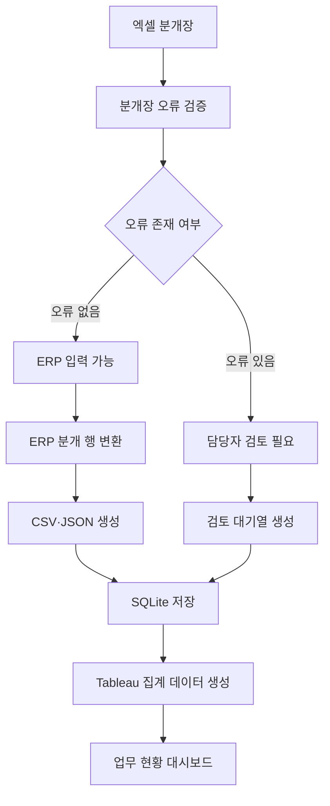

# 시스템 처리 흐름

## 1. 문서 목적

본 문서는 엑셀 분개장이 검증되고 ERP 업로드 데이터와 Tableau 대시보드 데이터로 변환되는 전체 처리 과정을 정리한 문서이다.

시스템은 ERP에 전표를 직접 등록하지 않는다. ERP 입력 전 데이터를 검증하고, 담당자가 확인해야 할 전표를 분리하며, 검증을 통과한 전표의 업로드 파일을 생성한다.

---

## 2. 전체 시스템 흐름



---

## 3. 단계별 처리 내용

| 단계 | 실행 파일 | 주요 역할 |
|---|---|---|
| 1. 분개장 검증 | `src/journal_validator.py` | 분개장의 기준정보·금액·필수값 오류 검증 |
| 2. ERP 데이터 변환 | `src/prepare_erp_upload.py` | 정상 전표를 ERP 입력용 분개 행과 JSON으로 변환 |
| 3. 데이터베이스 적재 | `src/load_database.py` | 기준정보, 전표, 오류 및 분개 행을 SQLite에 저장 |
| 4. 대시보드 데이터 생성 | `src/export_dashboard_data.py` | Tableau에서 사용할 집계 CSV 생성 |
| 전체 실행 | `src/run_pipeline.py` | 위 작업을 정해진 순서대로 일괄 실행 |

---

## 4. 입력 데이터

### 분개장

`data/raw/bulk_journal.xlsx`

가상의 자동차부품 제조기업에서 발생한 회계 전표 500건을 포함한다.

### 계정과목 기준정보

`data/master/accounts.csv`

계정코드, 계정명, 계정분류, 정상잔액 방향, 부가세 유형 및 사용 여부를 관리한다.

### 거래처 기준정보

`data/master/vendors.csv`

거래처코드, 거래처명, 거래처 유형, 기본 계정과목, 결제 계정 및 부가세 적용 여부를 관리한다.

### 부서 기준정보

`data/master/departments.csv`

부서코드, 부서명, 원가중심점, 주요 역할 및 사용 여부를 관리한다.

---

## 5. 검증 및 상태 분류

각 전표에서 발견된 오류 개수를 기준으로 처리 상태를 결정한다.

- 오류 개수가 0이면 `입력 가능`으로 분류한다.
- 오류 개수가 1개 이상이면 `검토 필요`로 분류한다.

입력 가능 전표만 ERP 업로드 파일로 변환한다. 검토 필요 전표는 오류 원인과 상세 내용을 포함한 검토 대기열로 이동한다.

---

## 6. 주요 출력 데이터

| 출력 파일 | 생성 단계 | 사용 목적 |
|---|---|---|
| `bulk_validation_result.csv` | 분개장 검증 | 발견된 오류 목록 |
| `bulk_validation_comparison.csv` | 분개장 검증 | 주입 오류와 탐지 오류 비교 |
| `bulk_transaction_status.csv` | 분개장 검증 | 전표별 처리 상태 |
| `bulk_erp_upload.csv` | ERP 변환 | ERP 업로드용 분개 행 |
| `bulk_erp_upload.json` | ERP 변환 | 외부 시스템 연계용 JSON |
| `bulk_review_queue.csv` | ERP 변환 | 담당자 검토 대상 |
| `accounting_erp.db` | DB 적재 | 통합 데이터 저장 |
| `dashboard/data/*.csv` | 대시보드 추출 | Tableau 시각화 데이터 |

---

## 7. 데이터베이스 처리 구조

오류 포함 여부와 관계없이 모든 원본 전표를 `staging_transactions` 테이블에 저장한다.

탐지된 오류는 `validation_errors` 테이블에 저장한다. 검증을 통과한 전표만 `erp_vouchers`와 `journal_lines` 테이블에 저장한다.

이를 통해 잘못된 계정과목·거래처·부서 코드가 ERP 입력 대상 테이블에 들어가는 것을 방지한다.

```text
staging_transactions
├── validation_errors
└── 정상 전표
    ├── erp_vouchers
    └── journal_lines
```

---

## 8. 오류 발생 시 처리

`run_pipeline.py`는 각 단계를 정해진 순서대로 실행한다.

이전 단계에서 예외가 발생하면 파이프라인 실행을 중단하고 다음 단계를 실행하지 않는다.

예를 들어 분개장 검증 단계에서 오류가 발생하면 해당 실행에서 ERP 업로드 파일, 데이터베이스 및 대시보드 데이터를 새로 생성하지 않는다.

이 방식은 검증되지 않은 데이터가 다음 처리 단계로 전달되는 것을 방지한다.

---

## 9. 자동화 처리 범위

시스템은 다음 업무를 자동으로 수행한다.

- 입력 데이터 형식 검사
- 기준정보 존재 여부 확인
- 차변·대변 합계 검증
- 전표 총금액 검증
- 부가세 계산 검증
- 증빙번호 중복 검사
- 회계기간 검사
- 입력 가능·검토 필요 전표 분류
- ERP 업로드용 CSV·JSON 생성
- SQLite 데이터베이스 적재
- Tableau 대시보드용 데이터 생성

---

## 10. 담당자 확인 범위

담당자는 다음 업무를 수행한다.

- 검토 필요 전표의 원본 증빙 확인
- 잘못된 계정과목·거래처·부서 수정
- 예외적인 세무처리 판단
- 수정된 전표의 최종 승인
- 실제 ERP 업로드 또는 입력 실행

시스템은 반복적인 검사와 데이터 변환을 자동화하지만 최종 회계 판단과 ERP 등록 권한은 담당자에게 남겨 둔다.